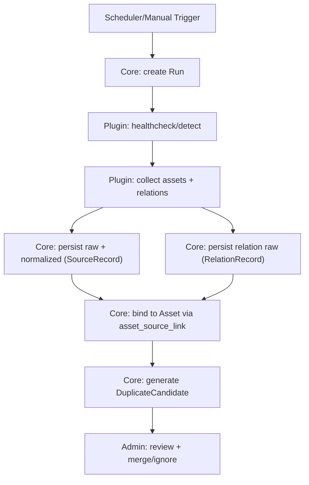
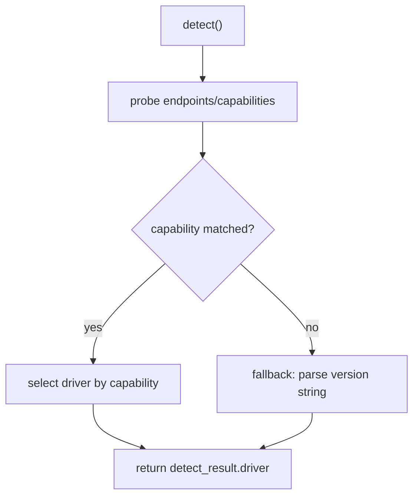

# 资产台账系统采集插件参考（开源组件优先）

版本：v1.3  
日期：2026-01-30

## 文档简介

本文档用于定义“采集插件（Collector）”的**接口契约**与**开源组件选型参考**，指导你以最低维护成本接入不同来源。

- 适用读者：采集插件开发者、平台研发、运维。
- 不包含：台账核心域逻辑的实现细节（入账、去重候选、合并、审计等由核心负责）。
- 关联文档：
  - SRS：`docs/requirements/asset-ledger-srs.md`
  - 概念数据模型：`docs/design/asset-ledger-data-model.md`
  - normalized/canonical JSON Schema：`docs/design/asset-ledger-json-schema.md`

> 目标：台账“本体”自研（入库、关系、疑似重复、人工合并、审计、台账字段等），采集插件尽量基于成熟开源组件/官方 SDK，插件只做“薄适配层”，避免重复造轮子。

## 1. 设计原则

1. **插件薄、核心厚**：插件只做目标探测 + 拉取 + 规范化输出 + raw 留存，不在插件里实现台账域逻辑（疑似重复、合并等由核心处理）。
2. **契约优先**：核心与插件通过“统一输入/输出契约”解耦；插件可用任意语言实现。
3. **能力探测优先于版本号**：优先以 capabilities/API 探测选择 driver；版本号仅作为 fallback。若产品要求“由用户在 Source 中选择版本范围/首选 driver”，则探测用于**校验/建议**，不得静默切换，也不得以降级方式伪成功。
4. **可回放**：插件必须输出 `raw_payload`（永久保留），便于后续回放/补算/审计。
5. **安全默认**：凭证只通过安全通道传递；插件日志必须脱敏；raw 中不得包含明文凭证。

## 2. 插件接口契约（概念）

### 2.1 输入（核心 → 插件）

插件通过 **stdin** 接收核心传入的 JSON 请求，最小结构：

````json
{
  "schema_version": "collector-request-v1",
  "source": {
    "source_id": "src_123",
    "source_type": "vcenter",
    "config": {},
    "credential": {}
  },
	  "request": {
	    "run_id": "run_456",
	    "mode": "detect|collect|collect_hosts|collect_vms|healthcheck",
	    "now": "2026-01-26T12:00:00Z"
	  }
	}
	```

> `schema_version` 用于契约版本化；当核心传入插件不支持的版本时，插件应失败并输出可读错误。
> `credential` 字段建议由核心在运行时注入（不落盘），插件不得将其写入日志/输出。

#### 2.1.A vCenter Source 输入字段（v1.0 约定）

为避免“插件能跑，但核心/文档对不齐”，vCenter Source 的最小输入约定如下：

- `source.config`（非敏感，可落库/可回显）
  - `endpoint`（必填）：支持填写 `https://<host>`（例如 `https://vcenter.example.com`）。实现侧可自行规范化为实际 SDK endpoint（例如自动补齐 `/sdk`），无需要求用户输入完整路径。
  - `preferred_vcenter_version`（必填，新增）：vCenter 版本范围（首选），用于选择采集 driver。
    - 枚举：`6.5-6.7` | `7.0-8.x`
  - `inventory_scope`（预留，可选）：v1.0 默认全量采集；当该字段为空/缺失时表示“全量”。
    - 建议结构（仅作预留，不作为 v1.0 验收项）：
      - `datacenter_names?: string[]`
      - `cluster_names?: string[]`
      - `folder_paths?: string[]`
- `source.credential`（敏感，运行时注入；不得落日志/不得回显）
  - `username`（必填）
  - `password`（必填）

TLS 说明：v1.0 允许自签名证书；实现侧固定跳过证书校验，不要求暴露额外配置项。

实现备注（v1.0 当前实现，vSphere REST 兼容性）：

- Session：使用 `POST /api/session`（Basic Auth）获取 session token；返回通常为 JSON 字符串（token）。
- 结构差异：vCenter REST API 返回的 `nics` 和 `disks` 为对象格式（以设备 ID 为 key），而非数组。
- 字段缺失：VM detail 可能不包含 VM 自身 ID 字段；实现侧应以 VM 列表摘要的 `vm` 作为 `external_id` 的单一来源（必要时在 detail 上注入该字段），避免入账阶段出现 `externalId missing`。
- **IP 地址获取**：VM 详情 API (`GET /api/vcenter/vm/{vm}`) **不返回 IP 地址**，需额外调用 Guest Networking API (`GET /api/vcenter/vm/{vm}/guest/networking/interfaces`) 获取，且需要 VMware Tools 运行。
- 多版本差异处理（新口径，禁止降级）：必须按 `preferred_vcenter_version` 选择对应 driver；当所选 driver 的关键能力缺失（关键接口不存在/无法取到必备字段）时，采集必须失败（`errors[]`），不得以 warning + fallback 的方式返回成功。
	- 关系边（vCenter 口径）：vCenter 环境应可稳定构建 VM→Host→Cluster 的关系；全量 `collect` 模式应尽量同时输出 `runs_on` / `member_of`（并可选输出 `hosts_vm`）。当使用分阶段采集时：`collect_hosts` 至少输出 `member_of`；`collect_vms` 至少输出 `runs_on`（并可选输出 `hosts_vm`）。

#### 2.1.B vSphere REST API 字段映射（v1.0）

> 参考文档：https://developer.broadcom.com/xapis/vsphere-automation-api/v7.0U2/

**VM 详情 API** (`GET /api/vcenter/vm/{vm}`)：

| vSphere API 字段         | 类型    | 说明                                                   |
| ------------------------ | ------- | ------------------------------------------------------ |
| `name`                   | string  | VM 显示名称                                            |
| `guest_OS`               | string  | 操作系统标识（如 `RHEL_8_64`、`WINDOWS_9_64`）         |
| `power_state`            | enum    | 电源状态：`POWERED_ON` \| `POWERED_OFF` \| `SUSPENDED` |
| `identity.instance_uuid` | string  | 实例 UUID（首选标识）                                  |
| `identity.bios_uuid`     | string  | BIOS UUID（备选标识）                                  |
| `identity.name`          | string  | 身份名称                                               |
| `cpu.count`              | integer | CPU 核心数                                             |
| `cpu.cores_per_socket`   | integer | 每插槽核心数                                           |
| `memory.size_MiB`        | integer | 内存大小（MiB）                                        |
| `disks`                  | object  | 虚拟磁盘（key 为磁盘 ID，如 `"2000"`）                 |
| `disks[id].label`        | string  | 磁盘标签（如 `"Hard disk 1"`）                         |
| `disks[id].capacity`     | integer | 磁盘容量（字节）                                       |
| `nics`                   | object  | 网络适配器（key 为 NIC ID，如 `"4000"`）               |
| `nics[id].mac_address`   | string  | MAC 地址                                               |
| `nics[id].label`         | string  | NIC 标签                                               |

**Guest Networking API** (`GET /api/vcenter/vm/{vm}/guest/networking`)：

> 注意：此 API 需要 VMware Tools 在 VM 中运行，否则返回空或错误。

| vSphere API 字段         | 类型   | 说明                                  |
| ------------------------ | ------ | ------------------------------------- |
| `dns_values.host_name`   | string | **Guest hostname（VM 内部的机器名）** |
| `dns_values.domain_name` | string | Guest 域名                            |

**Guest Networking Interfaces API** (`GET /api/vcenter/vm/{vm}/guest/networking/interfaces`)：

> 注意：此 API 需要 VMware Tools 在 VM 中运行，否则返回空或错误。

| vSphere API 字段                  | 类型    | 说明                       |
| --------------------------------- | ------- | -------------------------- |
| `mac_address`                     | string  | 接口 MAC 地址              |
| `nic`                             | string  | 关联的 NIC 设备 key        |
| `ip.ip_addresses[]`               | array   | IP 地址列表                |
| `ip.ip_addresses[].ip_address`    | string  | IP 地址（IPv4 或 IPv6）    |
| `ip.ip_addresses[].prefix_length` | integer | 子网前缀长度               |
| `ip.ip_addresses[].origin`        | string  | IP 来源（DHCP、STATIC 等） |

**字段映射到 normalized-v1**：

| vSphere 字段                                        | normalized-v1 字段            | 转换说明                            |
| --------------------------------------------------- | ----------------------------- | ----------------------------------- |
| `identity.instance_uuid` / `identity.bios_uuid`     | `identity.machine_uuid`       | 优先 instance_uuid                  |
| `guest_networking_info.dns_values.host_name`        | `identity.hostname`           | **Guest hostname（VM 内部机器名）** |
| `cpu.count`                                         | `hardware.cpu_count`          | 直接映射                            |
| `memory.size_MiB`                                   | `hardware.memory_bytes`       | MiB × 1024 × 1024                   |
| `disks[*].capacity`                                 | `hardware.disks[].size_bytes` | 直接映射                            |
| `nics[*].mac_address`                               | `network.mac_addresses[]`     | 提取所有 MAC                        |
| `guest_networking[*].ip.ip_addresses[*].ip_address` | `network.ip_addresses[]`      | **仅提取 IPv4 地址**                |
| `guest_OS`                                          | `os.fingerprint`              | 直接映射                            |
| `power_state`                                       | `runtime.power_state`         | 转换：`POWERED_ON` → `poweredOn`    |

**关系类型**：

| 关系类型    | 方向           | 说明                           |
| ----------- | -------------- | ------------------------------ |
| `runs_on`   | VM → Host      | VM 运行在哪个 Host 上          |
| `hosts_vm`  | Host → VM      | Host 托管了哪些 VM（反向关系） |
| `member_of` | Host → Cluster | Host 属于哪个 Cluster          |

**VM-Host 关系获取**：

> **重要**：vSphere REST API 的 VM 详情 (`GET /api/vcenter/vm/{vm}`) **不返回 host 字段**！

获取 VM 和 Host 关系的方法是通过 VM 列表 API 的 `hosts` 过滤参数：

````

GET /api/vcenter/vm?hosts={host_id}

````

**实现策略**：

1. 先获取所有 Host 列表 (`GET /api/vcenter/host`)
2. 对每个 Host，调用 `GET /api/vcenter/vm?hosts={host_id}` 获取该 Host 上的 VM 列表
3. 构建 VM → Host 的映射关系
4. 在获取 VM 详情时注入 `host` 字段

#### 2.1.C vSphere SOAP（vim25）字段映射（Host ESXi 版本/硬件/本地盘总量）

> 背景：vSphere REST API 对 Host 的 ESXi 版本/构建号与硬件规格信息不稳定/缺失；本项目约定 Host（ESXi）侧关键盘点字段统一通过 vSphere Web Services（SOAP, `/sdk`）采集。

**SDK endpoint**：`https://<vcenter>/sdk`（基于 `source.config.endpoint` 自动补齐 `/sdk`，不要求用户输入完整路径）。

**推荐采集方式（批量，避免 N+1）**：

- `RetrieveServiceContent` → 取得 `SessionManager` / `PropertyCollector`
- `SessionManager.Login(userName, password)` → 通过 Cookie 维持会话
- `PropertyCollector.RetrievePropertiesEx` → 批量读取所有 Host 的字段（同一 run 内 SOAP 登录最多一次）

**HostSystem 字段映射到 normalized-v1**：

| HostSystem（SOAP）字段                                                                                                                                               | normalized-v1 字段                 | 说明                                                              |
| -------------------------------------------------------------------------------------------------------------------------------------------------------------------- | ---------------------------------- | ----------------------------------------------------------------- |
| `summary.config.product.version`                                                                                                                                     | `os.version`                       | 必采；列表展示 `ESXi {version}`                                   |
| `summary.config.product.build`                                                                                                                                       | `os.fingerprint`                   | 必采必落库；**Host build 本期不用于搜索/展示**                    |
| `summary.hardware.numCpuCores`                                                                                                                                       | `hardware.cpu_count`               | 必采（核心数）                                                    |
| `summary.hardware.memorySize`                                                                                                                                        | `hardware.memory_bytes`            | 必采（bytes）                                                     |
| `summary.hardware.cpuModel`                                                                                                                                          | `attributes.cpu_model`             | 可选                                                              |
| `summary.hardware.cpuMhz`                                                                                                                                            | `attributes.cpu_mhz`               | 可选                                                              |
| `summary.hardware.numCpuPkgs`                                                                                                                                        | `attributes.cpu_packages`          | 可选                                                              |
| `summary.hardware.numCpuThreads`                                                                                                                                     | `attributes.cpu_threads`           | 可选                                                              |
| `hardware.systemInfo.serialNumber`（或从 `hardware.systemInfo.otherIdentifyingInfo` 提取 ServiceTag/Serial）                                                         | `identity.serial_number`           | 建议（整机序列号；best-effort）                                   |
| `datastore` → Datastore `summary.name/capacity`（过滤 `type in {NFS,NFS41,vsan}`）                                                                                   | `storage.datastores[]`             | 盘点增强：Host 上 datastore 明细（name/capacity_bytes；口径同总量） |
| `datastore` → Datastore `summary.type/capacity`（过滤 `type in {NFS,NFS41,vsan}`）                                                                                   | `attributes.datastore_total_bytes` | 建议（Host 上 datastore 总容量；排除 NFS/NFS41/vSAN；= 明细求和） |
| `config.storageDevice.scsiLun`（`lunType == "disk"` 且有 `capacity`） + `config.storageDevice.nvmeTopology`（HostNvmeNamespace: blockSize \* capacityInBlocks 求和） | `attributes.disk_total_bytes`      | 必采（仅本地物理盘 total，不采集 used；无法判定则缺失并 warning） |

**约束建议**：

- TLS：v1 允许自签名；实现侧可跳过证书校验（与 Web 侧策略一致）。
- 超时：30s；失败不重试，直接降级为字段缺失并写 warning（不影响 inventory complete）。

### 2.2 输出（插件 → 核心）

插件通过 **stdout** 输出 JSON 响应，包含四块：

```json
{
  "schema_version": "collector-response-v1",
  "detect": {
    "target_version": "8.1",
    "capabilities": {},
    "driver": "pve-cap-v2"
  },
  "assets": [
    {
      "external_kind": "vm|host|cluster",
      "external_id": "opaque-string",
      "normalized": {},
      "raw_payload": {}
    }
  ],
  "relations": [
    {
      "type": "runs_on|member_of",
      "from": { "external_kind": "vm", "external_id": "..." },
      "to": { "external_kind": "host|cluster", "external_id": "..." },
      "raw_payload": {}
    }
  ],
  "stats": { "assets": 0, "relations": 0, "inventory_complete": true, "warnings": [] },
  "errors": []
}
````

关键约束：

- `schema_version` 必须存在，用于契约版本化。
- `assets[].normalized.version` 必须存在且为 `normalized-v1`，并符合 schema（见：`docs/design/asset-ledger-json-schema.md`）。
- `external_id` 必须在“同一 Source 内稳定”，用于持续追踪（asset_source_link 的 `(source_id, external_kind, external_id)` 唯一）。
- 对 `mode=collect`：插件输出必须代表该 Source 的“完整资产清单快照”（inventory complete）。若因权限/分页/接口错误无法保证完整，必须失败并在 `errors[]` 中说明；不得以 warnings 方式标记成功。
- `stats.inventory_complete` 必须存在（仅 collect 有意义）：`true` 表示本次清单完整且可用于推进 missing/offline 语义；失败 Run 不得标记为 `true`。
- `raw_payload` 永久保留；核心必须在 PostgreSQL 内联持久化 raw 并记录必要元数据（参见第 6 节）；`raw_hash` 由核心计算。
- `relations[].raw_payload` 永久保留，核心落到 `relation_record`。
- `relations[]` 引用的端点（from/to）必须在同次输出的 `assets[]` 中存在；如无法提供端点资产，插件不得输出该关系。
- 阿里云不映射 Cluster：`cluster` 资产可不输出；`runs_on/member_of` 关系可为空。

**errors 与 warnings 的落库口径**

- `errors[]` 持久化到 `run.errors`
- `stats.warnings[]` 持久化到 `run.warnings`

### 2.3 错误模型与退出约定（建议）

> 目标：让核心能稳定判定 Run 成败、是否可重试，并在 UI/日志中提供“可读且脱敏”的错误信息。

#### 2.3.1 errors[] 结构（建议）

当插件执行失败（healthcheck/detect/collect 任一模式）时：

- 插件应在输出 JSON 中填充 `errors[]`（即使退出码非 0）。
- 错误信息必须脱敏：不得包含明文凭证、Token、AK/SK、密码。

建议单条 error 结构：

```json
{
  "code": "VCENTER_AUTH_FAILED",
  "category": "auth|permission|network|rate_limit|parse|config|unknown",
  "message": "human readable, redacted",
  "retryable": true,
  "redacted_context": { "endpoint": "/api/...", "http_status": 403, "trace_id": "..." }
}
```

> `errors[].code` 建议使用稳定错误码（避免各插件随意造词）；vCenter MVP 的错误码注册表见：`docs/design/asset-ledger-error-codes.md`。

#### 2.3.2 子进程退出码

**错误信号主判据**

- 子进程以退出码判定成功（0 成功，非 0 失败）；`errors[]` 用于解释与分类。

#### 2.3.3 部分成功（partial success）处理

采集过程可能出现“已采集部分资产，但中途失败”的情况。

**部分成功落库**

- 允许落库已采集的 `source_record/raw` 用于排障，但该 Run 仍标记为 Failed；核心不得据此推进 missing/last_seen/关系 last_seen（仅成功 Run 才能推进）。

#### 2.3.4 warnings 的语义（非致命）

- `stats.warnings[]` 表示“非致命问题”（例如部分字段缺失、少数对象详情读取失败），Run 可仍视为成功。
- 若问题影响“完整资产清单”（例如无法列举对象/分页中断/列表接口权限不足），必须作为 `errors[]` 处理并使 Run 失败；不得以 warnings 方式成功返回不完整清单。
- `warnings` 不得包含敏感信息；建议仅包含可定位问题的上下文摘要。

### 2.4 normalized 最小字段集合（满足 dup-rules-v1）

> 口径：键不存在时视为缺失，缺失不计分；实现可按来源能力填充。

- `identity.machine_uuid`（vm）
- `network.mac_addresses[]`（vm）
- `network.ip_addresses[]`（vm）
- `identity.hostname`（vm）
- `identity.serial_number`（host）
- `network.management_ip`（host，可为 in-band 管理 IP）
- `network.bmc_ip`（host，out-of-band 管理 IP；如可得强烈建议提供）
- 辅助键（用于解释与人工研判，不强制计分）：`os.fingerprint`、`resource.profile`、`identity.cloud_native_id`

> normalized-v1 完整结构与示例见：`docs/design/asset-ledger-json-schema.md`。

## 3. 采集流程与职责边界



## 4. 目标版本适配策略（driver 选择）

推荐策略：

- 插件内部维护多个 driver（例如 `pve-driver-v1`、`pve-driver-v2`）。
- `detect()` 先探测 capabilities（例如 API endpoint/字段存在性/权限集合），再选择 driver。
- 每次 Run 必须回传 `driver` 并由核心记录到 run 表中，便于排错与回滚。



## 5. 推荐开源组件清单（按来源）

> 说明：这里列的是“采集侧能力”的成熟组件。最终选型取决于你插件语言栈与运维形态（容器化/二进制/脚本）。

### 5.1 vCenter / ESXi（VM ↔ Host ↔ Cluster）

- Go：
  - `vmware/govmomi`（建议首选，生态成熟，含 `govc` CLI）。
- Python：
  - `pyVmomi`（VMware vSphere Python binding；可配合社区样例）。

采集要点：

- VM 强标识建议优先使用 vCenter 的 MoRef/UUID（确保同一 vCenter 内稳定）。
- 关系输出：
  - VM → Host：ESXi Host
  - Host → Cluster：vCenter Cluster（若无 cluster 概念则不输出 member_of）

### 5.2 PVE / Proxmox VE（VM ↔ Host ↔ Cluster）

- Python：
  - `proxmoxer`（REST API 封装，适合作为薄适配层）。
- Go：
  - `Telmate/proxmox-api-go`（REST API 封装）。

采集要点：

- `external_id` 可使用 `(node, vmid)` 组合（可序列化为一个字符串），确保同一 PVE 集群内稳定。
- Cluster 语义：PVE cluster；未配置 cluster 时不输出 cluster 资产，member_of 关系为空。

### 5.3 Hyper-V（VM ↔ Host ↔ Cluster）

推荐路线：**PowerShell（Hyper-V 模块）输出 JSON**，插件仅负责远程执行与解析。

- 远程执行：
  - Python：`pywinrm`（WinRM client）
  - Go：`masterzen/winrm`

采集要点：

- VM 强标识：Hyper-V VM ID（GUID）。
- Cluster：若是 Failover Cluster，可输出 Host→Cluster；否则 cluster 为空即可。

### 5.4 阿里云 ECS（VM 为主；Host/Cluster 为空）

推荐路线：使用官方 SDK v2，插件只做分页/限流/字段映射。

- Go：
  - `aliyun/alibabacloud-go-sdk`（v2）
    采集要点：

- `external_id`：实例 ID（instanceId）。
- 关系：不输出 runs_on/member_of（默认空）。
- Cluster：为空（不映射 region/zone/vpc）。

### 5.5 物理机/第三方平台（示例：Redfish、监控平台）

本系统不绑定具体平台；只要求插件输出 `host` 资产即可。

- Redfish（BMC）：
  - Go：`stmcginnis/gofish`
- 监控/资产平台（示例）：
  - Zabbix：Python `pyzabbix`（仅示例，不作为系统依赖）

采集要点：

- `external_id`：尽量使用平台内稳定 ID（hostId/设备序列号/管理 IP + 资产编号等）。
- 注意“同一物理机在多来源出现”的情况：交由核心生成疑似重复候选并人工合并。

## 6. Raw 永久保留与脱敏要求

### 6.1 插件侧责任（必须）

1. 插件必须输出 raw（`raw_payload`），核心永久保留（支持回放/补算/审计）。
2. raw 中不得包含明文凭证（Token/AK/SK/密码）。若目标 API 回显敏感字段，插件需在输出前清洗。
3. 插件日志必须脱敏；建议输出“可定位问题的上下文”（请求 URL/状态码/traceId 等），但不得输出密钥。

### 6.2 核心侧 raw 存储形态（必须）

> 说明：此处会影响插件契约（例如是否需要输出 raw_ref），因此在此明确。

**raw_payload 落库方案**

- 单机 PG-only：raw 以 **zstd** 压缩后内联存 PostgreSQL（`bytea`），并对高增长表做按月分区。
- raw 元数据固定为：`raw_ref/raw_hash/raw_size_bytes/raw_compression`（`raw_compression=zstd`）；`raw_ref` 固定为记录主键（`record_id`/`relation_record_id`）。

### 6.3 压缩策略

- 默认启用压缩并记录到 `raw_compression`：固定为 `zstd`。

## 7. 插件交付形态（v1.0 约定）

- 插件以独立二进制/脚本交付；核心以子进程方式调用；请求通过 stdin 传入，响应通过 stdout 输出。
- **插件超时配置**：环境变量 `ASSET_LEDGER_PLUGIN_TIMEOUT_MS`，默认值 `300000`（5 分钟），可配置范围 `60000~1800000`（1~30 分钟）。
  - 超时后核心会终止插件进程并标记 Run 失败（错误码 `PLUGIN_TIMEOUT`）。
  - 建议根据 Source 规模调整：小规模（< 500 资产）可用默认值；大规模（> 5000 资产）建议增加到 10~15 分钟。

## 8. 插件开发快速指南

### 8.1 开发环境准备

```bash
# 1. 克隆仓库
git clone <repo-url>
cd breach

# 2. 安装依赖（以 TypeScript 插件为例）
bun install

# 3. 创建插件目录
mkdir -p plugins/vcenter
```

### 8.2 插件骨架（TypeScript）

```typescript
// plugins/vcenter/index.ts
import { z } from 'zod';

// 输入 schema
const CollectorRequestSchema = z.object({
  schema_version: z.literal('collector-request-v1'),
  source: z.object({
    source_id: z.string(),
    source_type: z.string(),
    config: z.object({
      endpoint: z.string(),
    }),
    credential: z.object({
      username: z.string(),
      password: z.string(),
    }),
  }),
  request: z.object({
    run_id: z.string(),
    mode: z.enum(['detect', 'collect', 'healthcheck']),
    now: z.string(),
  }),
});

// 输出 schema
interface CollectorResponse {
  schema_version: 'collector-response-v1';
  detect?: {
    target_version: string;
    capabilities: Record<string, boolean>;
    driver: string;
  };
  assets: Asset[];
  relations: Relation[];
  stats: {
    assets: number;
    relations: number;
    inventory_complete: boolean;
    warnings: string[];
  };
  errors: ErrorItem[];
}

// 主函数
async function main() {
  // 1. 读取 stdin
  const input = await readStdin();
  const request = CollectorRequestSchema.parse(JSON.parse(input));

  // 2. 根据 mode 执行
  let response: CollectorResponse;
  try {
    switch (request.request.mode) {
      case 'healthcheck':
        response = await healthcheck(request);
        break;
      case 'detect':
        response = await detect(request);
        break;
      case 'collect':
        response = await collect(request);
        break;
    }
  } catch (error) {
    response = createErrorResponse(error);
    process.exitCode = 1;
  }

  // 3. 输出到 stdout
  console.log(JSON.stringify(response));
}

main();
```

### 8.3 实现 healthcheck

```typescript
async function healthcheck(request: CollectorRequest): Promise<CollectorResponse> {
  const { endpoint } = request.source.config;
  const { username, password } = request.source.credential;

  try {
    // 尝试连接 vCenter
    const client = await createVCenterClient(endpoint, username, password);
    await client.testConnection();

    return {
      schema_version: 'collector-response-v1',
      assets: [],
      relations: [],
      stats: { assets: 0, relations: 0, inventory_complete: false, warnings: [] },
      errors: [],
    };
  } catch (error) {
    return {
      schema_version: 'collector-response-v1',
      assets: [],
      relations: [],
      stats: { assets: 0, relations: 0, inventory_complete: false, warnings: [] },
      errors: [mapToError(error)],
    };
  }
}
```

### 8.4 实现 detect

```typescript
async function detect(request: CollectorRequest): Promise<CollectorResponse> {
  const client = await createVCenterClient(/* ... */);

  // 探测 vCenter 版本与能力
  const about = await client.getAbout();
  const capabilities = await probeCapabilities(client);

  // 选择 driver
  const driver = selectDriver(about.version, capabilities);

  return {
    schema_version: 'collector-response-v1',
    detect: {
      target_version: about.version,
      capabilities,
      driver,
    },
    assets: [],
    relations: [],
    stats: { assets: 0, relations: 0, inventory_complete: false, warnings: [] },
    errors: [],
  };
}

function selectDriver(version: string, capabilities: Record<string, boolean>): string {
  // 优先按能力选择
  if (capabilities['rest_api_v7']) return 'vcenter-rest-v7';
  if (capabilities['rest_api_v6']) return 'vcenter-rest-v6';
  // 回退到版本号
  if (version.startsWith('8.')) return 'vcenter-soap-v8';
  if (version.startsWith('7.')) return 'vcenter-soap-v7';
  return 'vcenter-soap-legacy';
}
```

### 8.5 实现 collect

```typescript
async function collect(request: CollectorRequest): Promise<CollectorResponse> {
  const client = await createVCenterClient(/* ... */);
  const assets: Asset[] = [];
  const relations: Relation[] = [];
  const warnings: string[] = [];

  try {
    // 1. 采集 Cluster
    const clusters = await client.listClusters();
    for (const cluster of clusters) {
      assets.push(normalizeCluster(cluster));
    }

    // 2. 采集 Host
    const hosts = await client.listHosts();
    for (const host of hosts) {
      assets.push(normalizeHost(host));
      // Host → Cluster 关系
      if (host.cluster) {
        relations.push({
          type: 'member_of',
          from: { external_kind: 'host', external_id: host.moRef },
          to: { external_kind: 'cluster', external_id: host.cluster.moRef },
          raw_payload: { host_moref: host.moRef, cluster_moref: host.cluster.moRef },
        });
      }
    }

    // 3. 采集 VM
    const vms = await client.listVMs();
    for (const vm of vms) {
      assets.push(normalizeVM(vm));
      // VM → Host 关系
      if (vm.host) {
        relations.push({
          type: 'runs_on',
          from: { external_kind: 'vm', external_id: vm.moRef },
          to: { external_kind: 'host', external_id: vm.host.moRef },
          raw_payload: { vm_moref: vm.moRef, host_moref: vm.host.moRef },
        });
      }
    }

    return {
      schema_version: 'collector-response-v1',
      assets,
      relations,
      stats: {
        assets: assets.length,
        relations: relations.length,
        inventory_complete: true,
        warnings,
      },
      errors: [],
    };
  } catch (error) {
    // 部分成功：返回已采集数据，但标记失败
    return {
      schema_version: 'collector-response-v1',
      assets,
      relations,
      stats: {
        assets: assets.length,
        relations: relations.length,
        inventory_complete: false,
        warnings,
      },
      errors: [mapToError(error)],
    };
  }
}
```

## 9. 测试用例示例

### 9.1 单元测试（Vitest）

```typescript
// plugins/vcenter/__tests__/normalize.test.ts
import { describe, it, expect } from 'vitest';
import { normalizeVM, normalizeHost, normalizeCluster } from '../normalize';

describe('normalizeVM', () => {
  it('should normalize VM with all fields', () => {
    const raw = {
      moRef: 'vm-123',
      name: 'test-vm',
      config: {
        uuid: '420b5a7e-6b8c-4d0e-9b2e-xxxxxxxxxxxx',
        hardware: { numCPU: 4, memoryMB: 8192 },
      },
      guest: {
        hostName: 'test-vm.local',
        ipAddress: '10.10.1.23',
        net: [{ macAddress: '00:50:56:aa:bb:cc' }],
      },
    };

    const result = normalizeVM(raw);

    expect(result.external_kind).toBe('vm');
    expect(result.external_id).toBe('vm-123');
    expect(result.normalized.version).toBe('normalized-v1');
    expect(result.normalized.kind).toBe('vm');
    expect(result.normalized.identity.hostname).toBe('test-vm.local');
    expect(result.normalized.identity.machine_uuid).toBe('420b5a7e-6b8c-4d0e-9b2e-xxxxxxxxxxxx');
    expect(result.normalized.hardware.cpu_count).toBe(4);
    expect(result.normalized.hardware.memory_bytes).toBe(8192 * 1024 * 1024);
  });

  it('should handle missing optional fields', () => {
    const raw = {
      moRef: 'vm-456',
      name: 'minimal-vm',
      config: { uuid: 'xxx' },
    };

    const result = normalizeVM(raw);

    expect(result.normalized.identity.hostname).toBeUndefined();
    expect(result.normalized.network.ip_addresses).toEqual([]);
  });
});

describe('normalizeHost', () => {
  it('should extract BMC IP from hardware info', () => {
    const raw = {
      moRef: 'host-789',
      name: 'esxi-01',
      hardware: {
        systemInfo: { serialNumber: 'CN12345678' },
      },
      config: {
        network: {
          ipmi: { bmcIpAddress: '10.10.9.11' },
        },
      },
    };

    const result = normalizeHost(raw);

    expect(result.normalized.identity.serial_number).toBe('CN12345678');
    expect(result.normalized.network.bmc_ip).toBe('10.10.9.11');
  });
});
```

### 9.2 集成测试（Mock vCenter）

```typescript
// plugins/vcenter/__tests__/integration.test.ts
import { describe, it, expect, beforeAll, afterAll } from 'vitest';
import { spawn } from 'child_process';
import { MockVCenterServer } from './mocks/vcenter-server';

describe('vCenter Plugin Integration', () => {
  let mockServer: MockVCenterServer;

  beforeAll(async () => {
    mockServer = new MockVCenterServer();
    await mockServer.start(8443);
  });

  afterAll(async () => {
    await mockServer.stop();
  });

  it('should complete healthcheck successfully', async () => {
    const request = {
      schema_version: 'collector-request-v1',
      source: {
        source_id: 'test-source',
        source_type: 'vcenter',
        config: { endpoint: 'https://localhost:8443' },
        credential: { username: 'admin', password: 'test' },
      },
      request: { run_id: 'run-001', mode: 'healthcheck', now: new Date().toISOString() },
    };

    const response = await runPlugin(request);

    expect(response.errors).toHaveLength(0);
  });

  it('should collect all assets and relations', async () => {
    // 设置 mock 数据
    mockServer.setInventory({
      clusters: [{ moRef: 'cluster-1', name: 'prod-cluster' }],
      hosts: [{ moRef: 'host-1', name: 'esxi-01', cluster: 'cluster-1' }],
      vms: [{ moRef: 'vm-1', name: 'test-vm', host: 'host-1' }],
    });

    const request = {
      schema_version: 'collector-request-v1',
      source: {
        source_id: 'test-source',
        source_type: 'vcenter',
        config: { endpoint: 'https://localhost:8443' },
        credential: { username: 'admin', password: 'test' },
      },
      request: { run_id: 'run-002', mode: 'collect', now: new Date().toISOString() },
    };

    const response = await runPlugin(request);

    expect(response.errors).toHaveLength(0);
    expect(response.stats.inventory_complete).toBe(true);
    expect(response.assets).toHaveLength(3); // 1 cluster + 1 host + 1 vm
    expect(response.relations).toHaveLength(2); // vm→host + host→cluster
  });

  it('should fail on auth error', async () => {
    mockServer.setAuthError(true);

    const request = {
      schema_version: 'collector-request-v1',
      source: {
        source_id: 'test-source',
        source_type: 'vcenter',
        config: { endpoint: 'https://localhost:8443' },
        credential: { username: 'wrong', password: 'wrong' },
      },
      request: { run_id: 'run-003', mode: 'healthcheck', now: new Date().toISOString() },
    };

    const response = await runPlugin(request);

    expect(response.errors).toHaveLength(1);
    expect(response.errors[0].code).toBe('VCENTER_AUTH_FAILED');
  });
});

async function runPlugin(request: object): Promise<CollectorResponse> {
  return new Promise((resolve, reject) => {
    const child = spawn('bun', ['run', 'plugins/vcenter/index.ts']);
    let stdout = '';

    child.stdin.write(JSON.stringify(request));
    child.stdin.end();

    child.stdout.on('data', (data) => {
      stdout += data;
    });
    child.on('close', () => {
      try {
        resolve(JSON.parse(stdout));
      } catch (e) {
        reject(e);
      }
    });
  });
}
```

### 9.3 Mock vCenter Server

```typescript
// plugins/vcenter/__tests__/mocks/vcenter-server.ts
import { createServer, Server } from 'https';
import { readFileSync } from 'fs';

export class MockVCenterServer {
  private server: Server | null = null;
  private inventory = { clusters: [], hosts: [], vms: [] };
  private authError = false;

  setInventory(data: { clusters: any[]; hosts: any[]; vms: any[] }) {
    this.inventory = data;
  }

  setAuthError(enabled: boolean) {
    this.authError = enabled;
  }

  async start(port: number): Promise<void> {
    const options = {
      key: readFileSync('test/certs/server.key'),
      cert: readFileSync('test/certs/server.crt'),
    };

    this.server = createServer(options, (req, res) => {
      if (this.authError) {
        res.writeHead(401);
        res.end(JSON.stringify({ error: 'Unauthorized' }));
        return;
      }

      // 模拟 vSphere API 响应
      if (req.url?.includes('/rest/vcenter/cluster')) {
        res.writeHead(200, { 'Content-Type': 'application/json' });
        res.end(JSON.stringify({ value: this.inventory.clusters }));
      } else if (req.url?.includes('/rest/vcenter/host')) {
        res.writeHead(200, { 'Content-Type': 'application/json' });
        res.end(JSON.stringify({ value: this.inventory.hosts }));
      } else if (req.url?.includes('/rest/vcenter/vm')) {
        res.writeHead(200, { 'Content-Type': 'application/json' });
        res.end(JSON.stringify({ value: this.inventory.vms }));
      } else {
        res.writeHead(404);
        res.end();
      }
    });

    return new Promise((resolve) => {
      this.server!.listen(port, resolve);
    });
  }

  async stop(): Promise<void> {
    return new Promise((resolve) => {
      this.server?.close(() => resolve());
    });
  }
}
```

## 10. vCenter Plugin 技术选型决策（v1.0）

> 决策日期：2026-01-28

### 10.1 选型结论

**vCenter Collector Plugin 采用 TypeScript + vSphere REST API 实现**。

### 10.2 备选方案对比

| 方案                      | 优点                                          | 缺点                                             |
| ------------------------- | --------------------------------------------- | ------------------------------------------------ |
| **Go + govmomi**          | VMware 官方 SDK；单二进制部署；完整 SOAP API  | 引入新语言，增加技术栈复杂度                     |
| **Python + pyVmomi**      | VMware 官方 SDK；开发快                       | 需 Python 运行时；依赖管理复杂                   |
| **TypeScript + REST API** | 与项目技术栈一致；复用工具/类型；Bun 直接运行 | 需自行封装 REST API；REST API 功能相对 SOAP 有限 |

### 10.3 选择 TypeScript 的理由

1. **技术栈统一**：项目主体为 Bun + TypeScript，插件使用相同技术栈可：
   - 复用 Zod schema、错误码、工具函数
   - 单一构建/测试流程
   - 降低团队学习成本

2. **vSphere REST API 满足 MVP 需求**：
   - vSphere 7+ 的 REST API 已覆盖 VM/Host/Cluster 列表、详情
   - MVP 只需 healthcheck/detect/collect，不涉及复杂操作

3. **部署简单**：`bun run plugins/vcenter/index.ts` 即可运行，无需额外编译

### 10.4 后续演进路径

若 REST API 无法满足后续需求（例如需要 SOAP-only 的字段），可选：

1. **Go 重写**：使用 govmomi 实现完整 SOAP 支持，编译为独立二进制
2. **混合方案**：TypeScript 主体 + 调用 `govc` CLI 获取特定数据

### 10.5 实现位置

```
plugins/vcenter/
├── index.ts              # 入口（stdin → mode 分发 → stdout）
├── client.ts             # vSphere REST API 封装
├── normalize.ts          # raw → normalized-v1 转换
├── types.ts              # 类型定义
└── __tests__/            # 测试
```

详细实现步骤见：`docs/mvp/plans/2026-01-28-asset-ledger-vcenter-mvp.md` Task 10。
