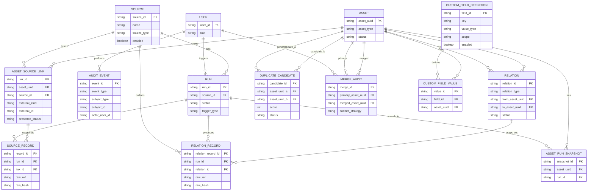

# 资产台账系统概念数据模型（Conceptual Data Model）

版本：v1.1  
日期：2026-01-26

## 文档简介

本文档用于沉淀“资产台账系统”的**概念数据模型**与关键约束：必须有哪些实体、如何关联、哪些字段需要可追溯、哪些唯一性/索引是硬约束。它回答“数据应该怎么组织”，不绑定具体数据库实现细节（字段类型/分库分表等可在实现阶段细化）。

- 适用读者：研发、测试、架构评审、DBA/运维。
- 使用方式：当 SRS（需求）与实现发生冲突时，用本文对齐“实体边界/约束/状态机”；发生歧义时，优先以 SRS 的业务语义为准。
- 关联文档：
  - SRS：`docs/requirements/asset-ledger-srs.md`
  - 采集插件参考：`docs/design/asset-ledger-collector-reference.md`
  - normalized/canonical JSON Schema：`docs/design/asset-ledger-json-schema.md`

> 本文为“概念模型 + 关键约束”沉淀，目标是让后续实现/评审对齐：哪些实体必须存在、如何关联、状态如何流转、哪些字段需要可追溯。本文不绑定具体数据库实现，但会标注关键唯一性与索引建议。

## 1. 建模原则

- **系统主键**：所有统一资产使用系统生成 `asset_uuid` 作为主键，不依赖外部平台 ID。
- **来源可追溯**：所有采集数据必须能追溯到 `source` 与 `run`，且 raw 永久保留。
- **软删除语义**：来源消失不删除数据，通过“可见性/下线状态”表达。
- **关系最小闭环**：仅支持 `VM --runs_on--> Host --member_of--> Cluster` 两类关系，允许缺边。
- **去重不自动合并**：跨来源重复仅生成 `duplicate_candidate`，由管理员手工合并。
- **规则固定**：疑似重复规则/阈值不做配置（后续迭代再开放）。

## 2. 实体清单（概念级）

> 下文字段以“建议字段”表达概念含义；实现可调整命名，但应保留语义与约束。

### 2.1 user（用户）

- `user_id`：主键
- `role`：`admin` / `user`
- `created_at`

### 2.2 source（来源）

- `source_id`：主键
- `name`：来源名称（唯一建议：同租户内对“未删除 Source”唯一）
- `source_type`：`aliyun` / `vcenter` / `pve` / `hyperv` / `third_party` …
- `enabled`：启用/停用（软删除后必须视为不可用）
- `schedule_group_id`：调度组外键（见 2.2A；用于“分组定时触发”）
- `config`：非敏感连接配置（JSON）
- `credential_ref`：凭证引用（密文存储在独立实体/密钥系统）
- `deleted_at`：软删除时间（空表示未删除；未删除才可参与调度/被手动触发）
- `created_at` / `updated_at`

### 2.2A schedule_group（调度组/采集任务）

> 目标：支持“不同采集任务在不同固定时间触发”，并允许按组控制并发与隔离负载。

- `group_id`：主键
- `name`：组名（唯一建议）
- `enabled`：启用/停用
- `timezone`：时区（IANA TZ，例如 `Asia/Shanghai`）
- `run_at_hhmm`：固定触发时间（`HH:mm`，按 `timezone` 解释）
- `max_parallel_sources`：该组同时允许执行的 Source 数量上限（可选；MVP 可固定为全局默认）
- `last_triggered_on`：上一次成功触发“调度入队”的日期（按 `timezone` 的 local date；用于避免重复触发）
- `created_at` / `updated_at`

**关键约束（建议）**

- 唯一：`(name)` 唯一

绑定方式（建议）：

- `source.schedule_group_id` 外键直接指向 `schedule_group`（一组多来源），实现最简单；如未来需要“一个来源属于多个任务”，再引入中间表。

### 2.3 run（采集批次）

- `run_id`：主键
- `source_id`：外键
- `trigger_type`：`schedule` / `manual`
- `mode`：`collect` / `detect` / `healthcheck`
- `triggered_by_user_id`：手动触发时记录操作者
- `status`：见 5.1 状态机
- `started_at` / `finished_at`
- `detect_result`：目标版本/能力探测摘要（JSON，脱敏）
- `collector_plugin`：插件标识（`plugin_id`、`plugin_version`）
- `collector_driver`：driver 标识（用于目标版本适配）
- `stats`：采集统计（新增/更新/缺失/关系数量等，JSON；建议包含 `inventory_complete` 用于判定是否可推进缺失/下线语义）
- `error_summary`：失败摘要（脱敏）
- `errors`：结构化错误数组（JSON，字段参考插件 `errors[]`）
- `warnings`：非致命告警数组（JSON，字段参考插件 `stats.warnings[]`）

### 2.4 asset（统一资产）

- `asset_uuid`：主键（系统生成）
- `asset_type`：`vm` / `host` / `cluster`
- `display_name`：展示名称（来源填充；允许管理员人工编辑覆盖）
- `status`：`in_service` / `offline` / `merged`（offline 可由可见性汇总计算，也可落库缓存）
- `merged_into_asset_uuid`：当 status=merged 时指向主资产
- `created_at` / `updated_at`

> 说明：统一字段（例如 CPU/内存/IP 等）固定通过 `asset_run_snapshot.canonical`（canonical-v1 JSON）表达，且必须可追溯来源（见 source_record 与审计）。

### 2.5 asset_source_link（统一资产与来源对象的绑定，用于持续追踪 + 软删除）

> 该实体用于解决两个问题：
>
> 1. **同一来源内**如何把“同一对象”在不同 Run 中持续归属到同一个 Asset（不等于跨来源自动合并）。
> 2. **软删除**：来源中消失的对象如何表达 last_seen 与可见性。

- `link_id`：主键
- `asset_uuid`：外键 → asset
- `source_id`：外键 → source
- `external_kind`：`vm` / `host` / `cluster`（与来源对象类型一致）
- `external_id`：来源侧强标识（如 vCenter MoRef、PVE VMID、阿里云 instanceId 等）
- `first_seen_at`：首次发现时间（Run 时间）
- `last_seen_at`：最后一次“被发现”的时间
- `presence_status`：`present` / `missing`
- `last_seen_run_id`：外键 → run（最后一次 present 的 run）
- `created_at` / `updated_at`

**关键约束（建议）**

- 唯一：`(source_id, external_kind, external_id)` 唯一  
  解释：同一来源同一对象只能对应一个绑定记录，确保“持续追踪”确定性。

### 2.6 source_record（来源记录：每次采集的原始快照，永久保留）

- `record_id`：主键
- `run_id`：外键 → run
- `source_id`：外键 → source（冗余可选，便于查询）
- `link_id`：外键 → asset_source_link（建议优先关联 link，而不是直接关联 asset）
- `asset_uuid`：外键 → asset（冗余可选，便于查询）
- `collected_at`：采集到该条记录的时间
- `normalized`：标准化字段（JSON）
- `raw_ref`：原始数据定位引用（固定为 `record_id`；永久保留）
- `raw`：原始数据内容（zstd 压缩后的 bytes；不得包含敏感信息）
- `raw_compression`：压缩算法（固定为 `zstd`）
- `raw_size_bytes`：压缩后大小（字节）
- `raw_mime_type`：内容类型（可选，例如 `application/json`）
- `raw_inline_excerpt`：少量内联摘录（可选，仅用于排障/列表摘要；不得包含敏感信息）
- `raw_hash`：原始数据摘要（用于快速比对/去重/审计）

**分区策略**

> 与 `relation_record` 共享相同的分区策略，详见 2.7 节的“分区策略”说明。

- **分区键**：`collected_at`
- **分区粒度**：按月分区
- **索引**：`(run_id)`、`(link_id)`、`(asset_uuid, collected_at desc)`

**normalized 最小字段集合（满足 dup-rules-v1）**

> 口径：键不存在时视为缺失，缺失不计分；实现可按来源能力填充。
> normalized-v1 完整结构见：`docs/design/asset-ledger-json-schema.md`。

- `identity.machine_uuid`（vm）
- `network.mac_addresses[]`（vm）
- `network.ip_addresses[]`（vm）
- `identity.hostname`（vm）
- `identity.serial_number`（host）
- `network.management_ip`（host，可为 in-band 管理 IP）
- `network.bmc_ip`（host，out-of-band 管理 IP；推荐优先提供）
- 辅助键（用于解释与人工研判，不强制计分）：`os.fingerprint`、`resource.profile`、`identity.cloud_native_id`

### 2.7 relation_record（关系来源记录：每次采集的关系 raw 快照，永久保留）

- `relation_record_id`：主键
- `run_id`：外键 → run
- `source_id`：外键 → source
- `relation_id`：外键 → relation（可空，核心 upsert 后回填）
- `relation_type`：`runs_on` / `member_of`
- `from_asset_uuid`：外键 → asset
- `to_asset_uuid`：外键 → asset
- `collected_at`：采集到该条记录的时间
- `raw_ref`：原始数据定位引用（固定为 `relation_record_id`；永久保留）
- `raw`：原始数据内容（zstd 压缩后的 bytes；不得包含敏感信息）
- `raw_compression`：压缩算法（固定为 `zstd`）
- `raw_size_bytes`：压缩后大小（字节）
- `raw_mime_type`：内容类型（可选，例如 `application/json`）
- `raw_inline_excerpt`：少量内联摘录（可选，仅用于排障/列表摘要；不得包含敏感信息）
- `raw_hash`：原始数据摘要

**关键约束（建议）**

- 索引：`(run_id)`、`(source_id)`、`(relation_type, from_asset_uuid, to_asset_uuid)`

**分区策略**

> 目标：控制高增长表的查询性能与维护成本，同时满足"永久保留"语义。

- **分区键**：`collected_at`（采集时间）
- **分区粒度**：按月分区（`YYYY-MM`）
- **分区命名**：`{table_name}_YYYYMM`（例如 `relation_record_202601`）
- **保留策略**：永久保留（不自动删除分区）；允许将历史分区迁移到低成本存储（如 tablespace 切换），但必须保持可查询
- **索引策略**：每个分区独立创建本地索引；全局索引仅用于跨分区查询的高频场景
- **容量估算**：
  - 假设：10 个 Source，每 Source 每日采集 1,000 资产，每条 raw 压缩后 ~2KB
  - 月增量：10 × 1,000 × 30 × 2KB ≈ 600MB/月（source_record）
  - 年增量：~7.2GB/年（source_record）；relation_record 约为其 1/10

### 2.8 relation（资产关系：VM↔Host↔Cluster）

- `relation_id`：主键
- `relation_type`：`runs_on` / `member_of`
- `from_asset_uuid`：外键 → asset
- `to_asset_uuid`：外键 → asset
- `source_id`：外键 → source（该关系由哪个来源采集/推断）
- `first_seen_at` / `last_seen_at`
- `status`：`active` / `inactive`（inactive 表示关系在后续 Run 中不再出现，但历史保留）

**关键约束（建议）**

- 唯一：`(relation_type, from_asset_uuid, to_asset_uuid, source_id)` 唯一  
  解释：同一来源对同一对资产的同类型关系应归并为一条关系边，并用 first/last_seen 表示持续时间。

### 2.9 duplicate_candidate（疑似重复候选）

- `candidate_id`：主键
- `asset_uuid_a`：外键 → asset
- `asset_uuid_b`：外键 → asset
- `score`：0-100
- `reasons`：命中原因（JSON，可解释）
- `status`：`open` / `ignored` / `merged`
- `created_at` / `updated_at`
- `last_observed_at`：最近一次命中时间（可选，用于降噪）
- `ignored_by_user_id` / `ignored_at` / `ignore_reason`（当 status=ignored）

**关键约束（建议）**

- 唯一：`(asset_uuid_a, asset_uuid_b)` 在规范化顺序（a<b）后唯一，避免重复候选。

### 2.10 merge_audit（合并审计：永久保留）

- `merge_id`：主键
- `primary_asset_uuid`：主资产（保留的 asset_uuid）
- `merged_asset_uuid`：被合并资产
- `performed_by_user_id`
- `performed_at`
- `conflict_strategy`：`primary_wins` / `latest_wins` / `manual_pick`（若实现了手工逐字段选择）
- `summary`：合并影响摘要（JSON）
- `snapshot_ref`：合并前快照引用（可选，为未来“撤销合并”预留）

**合并语义与不变量（必须）**

- 被合并资产：`asset.status=merged`，且必须设置 `merged_into_asset_uuid=primary_asset_uuid`；业务查询/列表默认隐藏（展示层可跳转到主资产）。
- 资产持续追踪：被合并资产的 `asset_source_link` 必须迁移/重绑定到主资产，迁移后仍需满足 `(source_id, external_kind, external_id)` 唯一约束（冲突时需去重合并）。
- 历史不丢：`source_record`、关系边与 `audit_event` 在查询层必须可追溯（通过实体迁移实现）。

### 2.11 audit_event（通用审计事件：永久保留）

> 目标：满足 SRS 的“重要操作审计永久保留”与“字段变更可追溯”。审计记录应**只增不改**（append-only），严禁物理删除。

- `event_id`：主键
- `occurred_at`：事件发生时间
- `event_type`：事件类型（建议使用 `domain.action` 命名，如 `source.updated`、`run.triggered`、`run.trigger_suppressed`、`duplicate_candidate.ignored`、`asset.merged`、`asset.ledger_fields_saved`、`asset.ledger_fields_bulk_set`）
- `actor_user_id`：操作者（系统自动事件可为空）
- `subject_type`：被影响对象类型（如 `source/run/asset/duplicate_candidate/asset_ledger_fields`）
- `subject_id`：被影响对象标识（字符串；例如 `asset_uuid`、`source_id`）
- `before`：变更前快照（JSON，可为空）
- `after`：变更后快照（JSON，可为空）
- `diff`：差异摘要（JSON，可选；用于减少 UI 计算成本）
- `context`：上下文（JSON，可选：request_id、ip、ua、trace_id 等；需脱敏）

**关键约束 / 索引建议**

- 索引：`(subject_type, subject_id, occurred_at desc)`（实体审计时间线）
- 索引：`(actor_user_id, occurred_at desc)`（按人追溯）
- 索引：`(event_type, occurred_at desc)`（按事件类型审计）

**审计落库形态**

- 仅使用 `audit_event` 统一承载所有审计（包括字段值变更）。

**subject 外键策略**

- 为常见对象增加可选 typed FK 列（`asset_uuid/source_id/run_id/candidate_id/...`），同时保留 `subject_type + subject_id`，以获得参照完整性与查询性能。

### 2.12 asset_ledger_fields（台账字段：预设字段集）

> 目标：提供业务补录字段用于盘点治理，但避免“字段定义可配置”带来的治理与兼容复杂度。
>
> 决策：采用**预设字段集（ledger-fields-v1）**，字段集合与类型固定；后续版本不提供新增/删除/停用/改类型能力（仅维护值）。

推荐数据模型（示例，一对一）：

`asset_ledger_fields`：

- `asset_uuid`：主键 + 外键 → asset
- 通用（vm + host）：
  - `region`、`company`、`department`、`system_category`、`system_level`、`biz_owner`（string，可为空）
- host 专用：
  - `maintenance_due_date`（date，可为空）
  - `purchase_date`（date，可为空）
  - `bmc_ip`（string，可为空；语义为 BMC/ILO 管理 IP，值需做 IPv4 校验）
  - `cabinet_no`、`rack_position`、`management_code`、`fixed_asset_no`（string，可为空）
- `updated_at`：更新时间

**关键约束 / 索引建议**

- 一对一：`asset_uuid` 唯一
- 索引（筛选/查询）：`company`、`department`、`system_category`、`system_level`

**历史追溯**

- 字段值历史不使用版本表；统一由 `audit_event` 承载（建议 eventType：`asset.ledger_fields_saved`、`asset.ledger_fields_bulk_set`）。

### 2.13 asset_run_snapshot（按 Run 的资产快照/摘要，物化）

> 目标：支撑 SRS 要求的“按 Run 的变化历史/快照/变更摘要”，并固化口径以提升读性能与一致性。

- `snapshot_id`：主键
- `asset_uuid`：外键 → asset
- `run_id`：外键 → run（表示该快照归属于哪个 Run）
- `asset_type`：冗余可选（便于过滤）
- `canonical`：统一视图快照（JSON；由 core 聚合生成）
- `diff_summary`：相对上一快照的变更摘要（JSON，可选）
- `computed_at`：计算时间

**快照口径（含关系）**

- `canonical` 必须包含关系摘要（runs_on/member_of 的目标引用与展示字段）
- `diff_summary` 必须包含关系变化（新增/移除/变化原因）

**canonical 聚合口径（canonical-v1）**

- `canonical` 建议采用“值 + provenance（来源）”结构：每个字段至少能回溯到 `source_id` 与 `run_id/collected_at`。
- 多值字段（如 IP/MAC 列表）使用去重并集；单值字段冲突时应显式表示冲突（保留当前选用值与备选值列表），以满足 UI 对比与审计需求。
- canonical-v1 完整结构见：`docs/design/asset-ledger-json-schema.md`。

**关键约束（建议）**

- 唯一：`(asset_uuid, run_id)` 唯一（同一资产同一 Run 只生成一条快照）
- 索引：`(asset_uuid, run_id)`、`(run_id)`、`(asset_uuid, computed_at desc)`

## 3. 核心关系（文本说明）

- source 1—N run
- run 1—N source_record
- run 1—N relation_record
- asset 1—N asset_source_link
- asset_source_link 1—N source_record
- relation 1—N relation_record
- run 1—N asset_run_snapshot
- asset 1—N asset_run_snapshot
- asset N—N asset（通过 relation）
- asset N—N asset（通过 duplicate_candidate 进行“候选关联”，不等于合并）
- merge_audit 记录 asset 合并历史（merged_asset_uuid → primary_asset_uuid）
- user 1—N audit_event（actor），audit_event 通过 subject 引用任意实体（typed FK + subject_type/id）

## 4. Mermaid：概念 ER 图



## 5. Mermaid：状态机

### 5.1 Run 状态


### 5.2 DuplicateCandidate 状态


> 说明：
>
> - `Ignored` 为终态：不提供 `reopen` 能力（不允许从 Ignored 回到 Open）。
> - 合并发生后候选进入 `Merged`；`Merged` 为终态。

## 6. 审计与历史口径（面向实现）

### 6.1 审计事件（audit_event）口径

- 审计应覆盖（最小集合）：source 创建/编辑/启停、Run 触发（手动/定时）、duplicate_candidate 忽略/合并、asset 合并、字段定义新增/停用、字段值更新。
- 审计记录应只增不改：任何更正以“新事件”追加，避免篡改历史。
- 审计数据需脱敏：不得记录明文凭证；context 中的 token/密码必须清洗。

### 6.2 “按 Run 的资产历史”口径

基础真相：`source_record` 是“每次 Run 的来源快照”，永久保留；它与 `asset_source_link` 绑定解决“同一来源内持续追踪”。

资产详情的“历史”建议按两条时间线组合展示：

1. **采集历史（Run-driven）**：按时间列出该资产关联的所有 `source_record`（可按 `run.started_at` 排序并分组）
2. **人工操作历史（Audit-driven）**：按时间列出影响该资产的 `audit_event`（字段值更新、合并、忽略等）

合并后的历史：当 asset B 合并进 asset A 时，B 的历史不应丢失；展示层可将 B 的 `source_record` 与 `audit_event` 归并到 A 的时间线中，同时保留“来源于被合并资产 B”的标识。

**历史快照形态**

- 物化 `asset_run_snapshot` 持久化“每次 Run 的展示快照/摘要”，以稳定口径并提升读性能。

### 6.3 成功/失败 Run 对“缺失/关系/状态”的影响（强约束）

- 仅 **Succeeded** 的 `mode=collect` Run 才能推进（且必须满足“资产清单完整”，建议由 `run.stats.inventory_complete=true` 表达）：
  - `asset_source_link.presence_status`（present/missing）与 `last_seen_at`
  - `relation.last_seen_at` 与 `relation.status`（active/inactive）
  - 由可见性汇总得到的 `asset.status`（in_service/offline）
- `mode=detect/healthcheck` 的 Run 不推进缺失/下线/关系失活语义（仅记录探测/连通性结果）。
- **Failed/Cancelled** 的 Run 可持久化错误与部分采集结果（用于排障），但不得作为“缺失/下线/关系失活”的依据。

## 7. 索引策略详解

### 7.1 索引设计原则

| 原则     | 说明                                   |
| -------- | -------------------------------------- |
| 查询驱动 | 索引基于实际查询模式设计，避免过度索引 |
| 写入平衡 | 高频写入表控制索引数量，避免写放大     |
| 分区感知 | 分区表使用本地索引，减少跨分区扫描     |
| 覆盖优先 | 高频查询优先使用覆盖索引               |

### 7.2 核心表索引清单

#### source

```sql
-- 主键
PRIMARY KEY (source_id)

-- 唯一约束
UNIQUE INDEX idx_source_name ON source(name)

-- 查询索引
INDEX idx_source_enabled ON source(enabled, source_type)
INDEX idx_source_schedule_group ON source(schedule_group_id)
```

#### run

```sql
-- 主键
PRIMARY KEY (run_id)

-- 查询索引（高频）
INDEX idx_run_source_status ON run(source_id, status, started_at DESC)
INDEX idx_run_started_at ON run(started_at DESC)
INDEX idx_run_status ON run(status) WHERE status IN ('Queued', 'Running')
```

#### asset

```sql
-- 主键
PRIMARY KEY (asset_uuid)

-- 查询索引
INDEX idx_asset_type_status ON asset(asset_type, status)
INDEX idx_asset_display_name ON asset(display_name)
INDEX idx_asset_merged_into ON asset(merged_into_asset_uuid) WHERE merged_into_asset_uuid IS NOT NULL
```

#### asset_source_link

```sql
-- 主键
PRIMARY KEY (link_id)

-- 唯一约束（持续追踪关键）
UNIQUE INDEX idx_asl_source_external ON asset_source_link(source_id, external_kind, external_id)

-- 查询索引
INDEX idx_asl_asset ON asset_source_link(asset_uuid)
INDEX idx_asl_presence ON asset_source_link(presence_status, last_seen_at DESC)
```

#### source_record（分区表）

```sql
-- 主键（含分区键）
PRIMARY KEY (record_id, collected_at)

-- 本地索引（每个分区独立）
INDEX idx_sr_run ON source_record(run_id) LOCAL
INDEX idx_sr_link ON source_record(link_id) LOCAL
INDEX idx_sr_asset_time ON source_record(asset_uuid, collected_at DESC) LOCAL
```

#### relation

```sql
-- 主键
PRIMARY KEY (relation_id)

-- 唯一约束
UNIQUE INDEX idx_rel_unique ON relation(relation_type, from_asset_uuid, to_asset_uuid, source_id)

-- 查询索引
INDEX idx_rel_from ON relation(from_asset_uuid, relation_type)
INDEX idx_rel_to ON relation(to_asset_uuid, relation_type)
INDEX idx_rel_status ON relation(status, last_seen_at DESC)
```

#### audit_event

```sql
-- 主键
PRIMARY KEY (event_id)

-- 查询索引（审计追溯）
INDEX idx_audit_subject ON audit_event(subject_type, subject_id, occurred_at DESC)
INDEX idx_audit_actor ON audit_event(actor_user_id, occurred_at DESC)
INDEX idx_audit_type ON audit_event(event_type, occurred_at DESC)

-- Typed FK 索引（可选）
INDEX idx_audit_asset ON audit_event(asset_uuid, occurred_at DESC) WHERE asset_uuid IS NOT NULL
INDEX idx_audit_source ON audit_event(source_id, occurred_at DESC) WHERE source_id IS NOT NULL
INDEX idx_audit_run ON audit_event(run_id, occurred_at DESC) WHERE run_id IS NOT NULL
```

### 7.3 分区表维护 SOP

#### 创建新分区（每月执行）

```sql
-- 示例：创建 2026-02 分区
CREATE TABLE source_record_202602 PARTITION OF source_record
    FOR VALUES FROM ('2026-02-01') TO ('2026-03-01');

CREATE TABLE relation_record_202602 PARTITION OF relation_record
    FOR VALUES FROM ('2026-02-01') TO ('2026-03-01');

-- 创建本地索引
CREATE INDEX idx_sr_run_202602 ON source_record_202602(run_id);
CREATE INDEX idx_sr_link_202602 ON source_record_202602(link_id);
CREATE INDEX idx_sr_asset_time_202602 ON source_record_202602(asset_uuid, collected_at DESC);
```

#### 分区维护检查清单

| 检查项       | 频率 | 操作               |
| ------------ | ---- | ------------------ |
| 分区是否存在 | 每月 | 提前创建下月分区   |
| 分区大小     | 每周 | 监控增长趋势       |
| 索引健康     | 每月 | REINDEX 碎片化索引 |
| 查询性能     | 每周 | 检查慢查询日志     |

#### 历史分区迁移（可选）

```sql
-- 将历史分区迁移到低成本 tablespace
ALTER TABLE source_record_202501 SET TABLESPACE archive_tablespace;

-- 注意：迁移后仍可查询，但 I/O 性能可能下降
```

### 7.4 索引监控指标

| 指标         | 阈值       | 告警级别 |
| ------------ | ---------- | -------- |
| 索引膨胀率   | > 30%      | Warning  |
| 索引扫描比例 | < 90%      | Warning  |
| 顺序扫描次数 | > 1000/min | Info     |
| 索引大小增长 | > 10%/周   | Info     |

```sql
-- 索引使用统计查询
SELECT
    schemaname,
    tablename,
    indexname,
    idx_scan,
    idx_tup_read,
    idx_tup_fetch
FROM pg_stat_user_indexes
WHERE schemaname = 'public'
ORDER BY idx_scan DESC;
```
