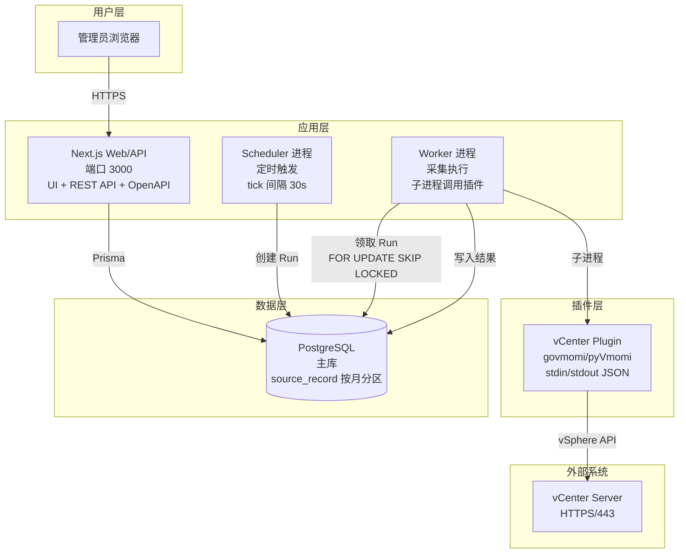
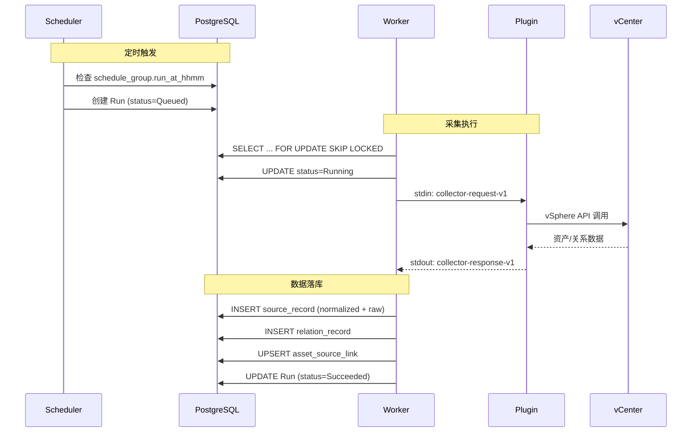

# 资产台账系统（vCenter MVP v1.0）- 技术设计文档（Design）

版本：v1.0  
日期：2026-01-27

## 文档简介

本文档对应 PRD：`docs/mvp/prds/asset-ledger-v1.0-prd.md`，用于承载“怎么做”的技术设计与库选型建议，避免与需求混写。

关联文档：

- PRD：`docs/mvp/prds/asset-ledger-v1.0-prd.md`
- SRS：`docs/requirements/asset-ledger-srs.md`
- 概念数据模型：`docs/design/asset-ledger-data-model.md`
- 插件契约参考：`docs/design/asset-ledger-collector-reference.md`
- normalized/canonical schema：`docs/design/asset-ledger-json-schema.md`

## 1. 架构概览（建议）

以"Web 不阻塞采集"为核心原则，拆成三块：

- **Web/API（Next.js）**：提供 UI + 最小 API（供 UI 调用）+ OpenAPI/Swagger 文档产物。
- **Run Orchestrator（Worker）**：独立进程；创建/推进 Run 状态机，调用插件并落库。
- **Collector Plugins（可多语言）**：负责 healthcheck/detect/collect；通过契约与核心解耦。

### 1.1 部署架构图

### 1.2 数据流图

## 2. 组件拆分（建议）

- Source Service：管理 source config/credential/enabled；调度策略按系统默认（MVP 不做 per-source 复杂配置）。
- Run Orchestrator：创建 Run、触发/抑制（同一 Source 单飞）、推进状态机、记录统计与错误。
- Plugin Runner：子进程执行插件，负责超时控制、stdout/stderr 捕获、退出码判定、错误脱敏兜底。
- Ingest Pipeline：raw + normalized 持久化、schema 校验、统计生成。
- Asset Binder：基于 `asset_source_link` 做持续追踪绑定；聚合 canonical 统一视图。
- Relation Upserter：关系边归并与 `first_seen/last_seen/status` 维护。
- Logging：Web 请求宽事件（canonical log line）+ 采集域事件日志。

## 3. 采集执行形态（子进程）

契约已在 `docs/design/asset-ledger-collector-reference.md` 给出；v1.0 固定采用子进程形态：

- 核心通过 stdin 传入 `collector-request-v1` JSON。
- 插件通过 stdout 输出 `collector-response-v1` JSON。
- 退出码：0 表示成功；非 0 表示失败（失败时仍需输出 `errors[]` 便于分类与脱敏展示）。
- 核心负责：超时控制、stdout/stderr 截断、脱敏兜底、错误码落库与日志落地。

## 4. 数据存储建议（满足可追溯/长期成本可控）

### 4.1 数据库

建议 PostgreSQL 作为主库：

- 关系模型清晰（Asset/Run/Source/Relation/Audit）。
- `jsonb` 适合承载 `normalized/canonical`（同时保留关键索引列用于检索）。
- 分区表可控长尾写入与查询性能。

### 4.2 raw 存储

你已明确“只用 PostgreSQL，不上对象存储”，因此建议：

- raw 固定落 PostgreSQL：以 **zstd** 压缩后存 `bytea`，并对高增长表做按月分区。
- 每条 raw 记录固定保留元数据：`raw_ref/raw_hash/raw_size_bytes/raw_compression`（`raw_compression=zstd`），用于审计、校验与容量评估。

> 备注：PG-only 会把“raw 的容量/备份恢复/迁移成本”全部压在 DB 上，建议尽早做：分区、容量告警、备份演练（哪怕 v1 不纳入验收）。

### 4.3 索引/分区（基于 PRD 的查询口径）

- `asset_source_link(source_id, external_kind, external_id)` 唯一（持续追踪关键）。
- `run(source_id, status, started_at desc)`（列表与定位）。
- `source_record(run_id)`、`source_record(asset_uuid)` + 分区键（按月）。
- `relation(relation_type, from_asset_uuid, to_asset_uuid, source_id)` 唯一。

## 5. 调度与并发策略（同一 Source 单飞）

无论定时还是手动触发，对同一 `source_id` 同时只允许一个活动 Run（Queued/Running）：

- 若触发时已有活动 Run：返回已有 `run_id`，并记录审计事件（例如 `run.trigger_suppressed`）。
- 只有成功 Run 才能推进 missing/offline 与关系 last_seen 等语义（失败 Run 仅用于排障证据沉淀）。

## 6. 接口与契约

- 插件契约：沿用 `collector-reference`；重点保证 `errors[]` 结构化、可读、可脱敏。
- API：以“UI 所需最小集合”为边界，优先稳定可用；OpenAPI/Swagger 作为交付物。
  - **OpenAPI**：以 Zod schema 为单一真相生成 OpenAPI JSON（避免手写漂移）。
  - 交付形态：提供 OpenAPI JSON（例如 `/api/openapi.json`）与 Swagger UI（例如 `/api/docs`；生产环境建议仅管理员可访问）。

## 7. 安全（建议）

- Source 凭证：加密存储（UI 不回显）；API/页面渲染/日志禁止明文输出；错误信息默认脱敏。
  - 推荐算法：`aes-256-gcm`（每条记录随机 nonce；密文携带 tag；带版本前缀便于未来迁移/轮转）。
  - 密钥：环境变量 `PASSWORD_ENCRYPTION_KEY`（32 bytes key，base64url；生产必须长期固定，否则重启后无法解密已存储凭据）。
- 登录与密码：
  - 管理员密码使用 bcrypt 哈希存储，成本由 `BCRYPT_LOG_ROUNDS` 控制（默认 12）。
  - 认证采用 session（HttpOnly Cookie）维持登录态；`SECRET_KEY` 用于会话签名；v1.0 不使用 JWT（`JWT_SECRET_KEY` 预留给后续迭代）。
- Secrets 管理：生产优先使用 Secret Manager（KMS/Cloud provider secrets）托管主密钥；MVP 可用环境变量（见 `README.md` 的环境变量章节；需制定轮转策略）。
- raw：v1.0 提供 admin-only 的 raw 查看入口（UI/API）；必须脱敏且访问动作必须记录审计（见 SRS/FR-10）。

## 8. 可观测性（建议）

- Web 请求：每个请求结束输出一条“宽事件”（包含 request_id/user_id/latency/status 等）。
- 采集流程：输出关键域事件（`run.created/run.started/plugin.invoked/plugin.failed/ingest.completed/run.finished`）。
- 日志字段规范：见 `docs/design/asset-ledger-logging-spec.md`（最小字段集合 + event_type 约定 + 脱敏/截断规则）。
- 可选增强：OpenTelemetry trace/span 贯穿 Web → Orchestrator → Plugin Runner。

## 9. 技术选型建议（库/组件）

> 下面是基于你已确认的“单机自建 + 子进程 + PG-only + Prisma”的推荐；如后续规模变化再升级。

### 9.1 后端与数据

- PostgreSQL：主库（建议）。
- ORM：Prisma（已确定）。
- JSON Schema 校验：Ajv（对 `normalized/canonical` 进行运行时校验）；API 入参继续用 Zod（已在仓库中）。
- ID：统一使用 Prisma `cuid()`（与当前 schema 对齐）。

### 9.2 调度与异步任务

你当前的“单机 + 子进程采集 + PG-only + 需要可配置分组定时”场景，BullMQ/Redis 确实偏重；建议用 **PostgreSQL 实现调度 + 队列**（不引入 Redis）：

**推荐拆成 2 个常驻进程**

1. `scheduler`：只负责“到点把任务转成 Run（Queued）”
2. `worker`：只负责“消费 Queued Run → 调用子进程插件 → 更新 Run 状态/落库”

**调度组（可配置、分组触发）建议模型**

- `schedule_group`：`group_id/name/enabled/timezone/run_at_hhmm/max_parallel_sources/last_triggered_on`
- `source.schedule_group_id`：来源绑定到调度组（调度策略不再散落在每个 Source 上）

**触发规则（固定时间 + 跳过补跑）**

- `scheduler` 每 30 秒 tick 一次（可配置；为满足 SRS 的“触发 ≤ 60 秒”要求，建议 tick ≤ 60 秒）：
  - 计算当前时间在 `timezone` 下的 `HH:mm` 与 `local_date`
  - 仅当 `HH:mm == run_at_hhmm` 且 `last_triggered_on != local_date` 才触发
  - 触发时在同一事务里锁住该 `schedule_group` 行（`FOR UPDATE`），更新 `last_triggered_on = local_date`，再批量插入该组下所有启用 Source 的 `run(status=Queued, trigger_type=schedule)`
- 由于触发条件是“到点才触发”，如果服务宕机错过触发点，重启后不会补跑（满足 skip）
- 夏令时（DST）语义（与 SRS 对齐）：
  - spring forward：若某个 `local_date` 当天本地时间不存在配置的 `HH:mm`，则该日自然不会满足触发条件 → 跳过（不补跑）。
  - fall back：若某个 `local_date` 当天 `HH:mm` 出现两次，`last_triggered_on` 以 local date 去重 → 仍只触发一次。

**队列与并发（仍然只用 PG）**

- `worker` 从 `run where status=Queued` 领取任务：
  - 使用 `SELECT ... FOR UPDATE SKIP LOCKED` 领取一批 run，置为 Running
  - 同一 Source 单飞：用事务内检查，确保同一 `source_id` 同时最多一个活动 Run（Queued/Running）
- 分组并发：可用 `schedule_group.max_parallel_sources` 控制该组的并行度（MVP 可先全局固定并发）

> 关键点：把“长耗时采集”从 Web 请求线程剥离出来（worker 进程），Web 只读/写状态与查询结果。

### 9.3 raw 压缩（PG-only）

- raw 固定为：应用层 **zstd** 压缩后存 PostgreSQL `bytea`，并记录 `raw_compression=zstd`。

### 9.4 鉴权与审计

- 认证：
  - 仅 admin MVP：简单用户名/密码 + session（数据库存 session）即可。
  - 需要企业化：Auth.js（NextAuth）+ OAuth/OIDC。
- 权限：RBAC（admin/user 两角色）优先用“服务端守卫 + 路由级授权”，不建议一开始引入复杂策略引擎。

### 9.5 API 文档与日志

- OpenAPI：基于 Zod schema 生成 OpenAPI JSON（单一真相），不手写。
- 日志：Pino（结构化 JSON）+ `pino-http`；结合“宽事件/Canonical Log Lines”规范落地。

### 9.6 前端（可选建议）

- 组件：shadcn/ui + Radix UI（可快速搭建管理后台）。
- 表格：TanStack Table + 虚拟滚动（资产列表可能很大）。
