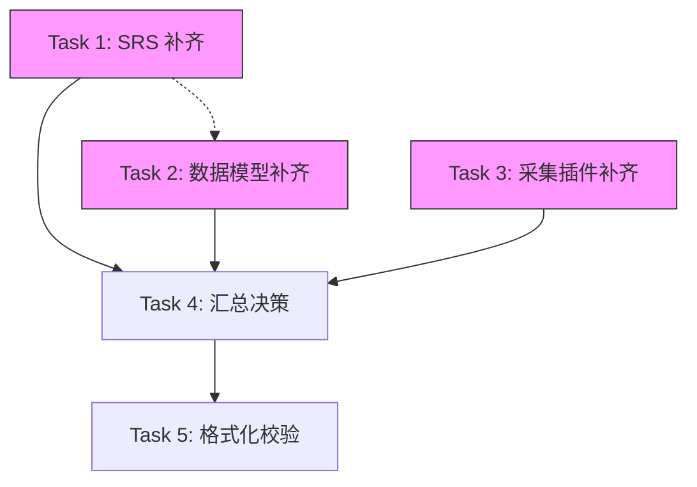

# Asset Ledger Requirements Gap Fill Implementation Plan

> **For Claude:** REQUIRED SUB-SKILL: Use superpowers:executing-plans to implement this plan task-by-task.

**Goal:** 为 `docs/requirements/` 下三份资产台账需求文档补齐 3 个关键缺口，并补充每份文档的“文档简介”与“决策记录（D-xx）”：

1. DuplicateCandidate 规则/评分/解释字典（落在 SRS）
2. 审计与历史口径（落在数据模型）
3. 插件错误模型 + raw 存储/压缩方案（落在采集插件参考）

**Architecture:** 直接在三份现有文档中新增对应章节；所有涉及选择的点必须给出唯一结论，并在文档末尾的 Decision Log 记录为“已确认”。

**Tech Stack:** Markdown、Mermaid（`~/.codex/skills/mermaid/scripts/validate_mermaid.sh`）、Prettier（`bun run format:check`）。

---

### Task 1: 补齐 SRS（1/3）— DuplicateCandidate 规则/评分/解释 + 文档简介

**Files:**

- Modify: `docs/requirements/asset-ledger-srs.md`

**Step 1: 增加“文档简介”**

- 在标题与版本信息后新增：适用读者/使用方式/与其它文档的关系。

**Step 2: 在 FR-07 下补充“固定规则说明”**

- 明确：候选生成时机、候选范围（asset_type/时间窗）、阈值（创建/展示）、抑制策略（ignored 后如何处理）。
- 给出：规则列表（rule_code）、证据字段（evidence）、评分权重（score）与解释字典。
- 不保留多方案表述；涉及选择的点直接给出唯一结论，并在 Decision Log 记录为“已确认”。

**Step 3: 小幅对齐语义**

- 明确“仅基于最新成功 Run 推进缺失/下线与关系 inactive”的口径（补充一句约束即可）。

---

### Task 2: 补齐数据模型（2/3）— 审计与历史口径 + ER 图更新 + 文档简介

**Files:**

- Modify: `docs/design/asset-ledger-data-model.md`

**Step 1: 增加“文档简介”**

- 同 Task 1 的结构，突出“概念模型 + 约束 + 图”的定位。

**Step 2: 增加审计实体（最小可落地）**

- 新增：`audit_event` 用于承载 merge/ignore/source 变更/字段变更/手工编辑等所有审计事件。
- 给出：字段建议、索引建议、常用查询路径。
- 将“字段历史追溯”的落库口径写清（与 SRS 的“永久保留”对齐）。
- 相关“history/快照”的取舍直接给出唯一结论，并记录到 Decision Log。

**Step 3: 增加历史口径（面向实现）**

- 明确：资产历史按 Run 展示时的数据来源（`source_record` 与 `asset_run_snapshot`）、合并后的历史归并规则。

**Step 4: 更新 Mermaid ER 图（如新增实体）并校验**
Run:

```bash
~/.codex/skills/mermaid/scripts/validate_mermaid.sh docs/design/asset-ledger-data-model.md
```

Expected: `✅` Valid。

---

### Task 3: 补齐采集插件参考（3/3）— 错误契约 + raw 存储/压缩方案 + 文档简介

**Files:**

- Modify: `docs/design/asset-ledger-collector-reference.md`

**Step 1: 增加“文档简介”**

- 说明：此文档是“插件契约 + 选型参考”，不是实现指南。

**Step 2: 补充错误模型与退出码约定（子进程）**

- 增加：`errors[]` 结构（category/retryable/redacted_context 等）与 `warnings[]` 语义。
- 说明：部分成功（partial success）是否允许、如何落库、如何影响核心的“missing 计算”。
- 不保留多方案表述；涉及选择的点直接给出唯一结论，并记录到 Decision Log。

**Step 3: 补充 raw 存储/压缩方案与阈值**

- raw 存储固定为：PostgreSQL 内联 `bytea` + `zstd` 压缩，并记录 `raw_ref/raw_hash/raw_size_bytes/raw_compression`。

**Step 4: 校验 Mermaid（如文档内含图）**
Run:

```bash
~/.codex/skills/mermaid/scripts/validate_mermaid.sh docs/design/asset-ledger-collector-reference.md
```

Expected: `✅` Valid。

---

### Task 4: 汇总决策记录 + README 入口（如需）

**Files:**

- Modify: `docs/requirements/asset-ledger-srs.md`
- Modify: `docs/design/asset-ledger-data-model.md`
- Modify: `docs/design/asset-ledger-collector-reference.md`
- Modify: `README.md` (optional)

**Step 1: 每份文档末尾新增“决策记录（Decision Log）”**

- 汇总该文档内出现过的 D-xx。

**Step 2: README（可选）**

- 若新增了新的补充文档/入口，则在 “资产台账系统文档” 下补一行链接；仅补充，不改动其它模板内容。

---

### Task 5: 格式化校验

Run:

```bash
bun run format:check
```

Expected: 通过（只允许报告与本次无关文件）。

---

## 优先级排序（Priority Matrix）

### 任务优先级

| 优先级 | 任务 | 依赖 | 预估工作量 | 风险 |
|-------|------|------|-----------|------|
| P0 | Task 1: SRS 补齐 DuplicateCandidate 规则 | 无 | 2h | 低 |
| P0 | Task 2: 数据模型补齐审计实体 | Task 1 | 2h | 中 |
| P0 | Task 3: 采集插件补齐错误契约 | 无 | 1.5h | 低 |
| P1 | Task 4: 汇总决策记录 | Task 1-3 | 0.5h | 低 |
| P1 | Task 5: 格式化校验 | Task 1-4 | 0.5h | 低 |

### 优先级定义

| 优先级 | 定义 | 处理方式 |
|-------|------|---------|
| P0 | 阻塞后续开发 | 必须在本迭代完成 |
| P1 | 重要但不阻塞 | 本迭代尽量完成 |
| P2 | 改进项 | 下迭代处理 |

### 依赖关系图



---

## 验收标准（Acceptance Criteria）

### Task 1 验收标准

| 检查项 | 验收条件 | 状态 |
|-------|---------|------|
| 文档简介 | 包含适用读者、使用方式、关联文档 | [ ] |
| FR-07 规则说明 | 包含候选生成时机、范围、阈值、抑制策略 | [ ] |
| 规则列表 | 包含 rule_code、evidence、score、解释 | [ ] |
| 决策记录 | 所有选择点有唯一结论并记录 D-xx | [ ] |
| 语义对齐 | 明确"仅基于成功 Run 推进"的口径 | [ ] |

### Task 2 验收标准

| 检查项 | 验收条件 | 状态 |
|-------|---------|------|
| 文档简介 | 突出"概念模型 + 约束 + 图"定位 | [ ] |
| audit_event 实体 | 字段完整、索引建议、查询路径 | [ ] |
| 历史口径 | 明确数据来源、合并后归并规则 | [ ] |
| ER 图更新 | 包含新增实体，Mermaid 校验通过 | [ ] |
| 决策记录 | history/快照取舍有唯一结论 | [ ] |

### Task 3 验收标准

| 检查项 | 验收条件 | 状态 |
|-------|---------|------|
| 文档简介 | 说明"插件契约 + 选型参考"定位 | [ ] |
| 错误模型 | errors[] 结构完整（category/retryable/context） | [ ] |
| warnings 语义 | 明确与 errors 的区别 | [ ] |
| 部分成功处理 | 明确是否允许、如何落库、影响 | [ ] |
| raw 存储方案 | 固定为 PG + zstd，字段完整 | [ ] |
| Mermaid 校验 | 通过 | [ ] |

### Task 4 验收标准

| 检查项 | 验收条件 | 状态 |
|-------|---------|------|
| 决策记录汇总 | 每份文档末尾有 Decision Log | [ ] |
| README 更新 | 如有新文档则补充链接 | [ ] |

### Task 5 验收标准

| 检查项 | 验收条件 | 状态 |
|-------|---------|------|
| 格式化检查 | `bun run format:check` 通过 | [ ] |
| 无新增 lint 错误 | 仅报告无关文件 | [ ] |

---

## 完成定义（Definition of Done）

### 单任务完成标准

- [ ] 所有验收条件满足
- [ ] 无遗留 TODO/FIXME
- [ ] 决策点有唯一结论
- [ ] Mermaid 图校验通过
- [ ] 格式化检查通过

### 整体完成标准

- [ ] 所有 P0 任务完成
- [ ] 所有 P1 任务完成或有明确延期理由
- [ ] 三份文档的决策记录完整
- [ ] README 入口更新（如需）
- [ ] CI 流水线通过

---

## 风险与缓解

| 风险 | 影响 | 概率 | 缓解措施 |
|-----|------|------|---------|
| 规则定义与实现不一致 | 开发返工 | 中 | 规则定义后与开发确认 |
| 审计实体设计过度 | 实现复杂度高 | 低 | 采用最小可落地方案 |
| 决策点遗漏 | 后续歧义 | 中 | 每个选择点显式记录 |
| Mermaid 语法错误 | 文档渲染失败 | 低 | 每次修改后校验 |

---

## 执行检查清单

### 开始前

- [ ] 确认三份目标文档存在
- [ ] 确认 Mermaid 校验脚本可用
- [ ] 确认 Prettier 配置正确

### 执行中

- [ ] Task 1 完成
- [ ] Task 2 完成
- [ ] Task 3 完成
- [ ] Task 4 完成
- [ ] Task 5 完成

### 完成后

- [ ] 所有决策记录完整
- [ ] 所有 Mermaid 图校验通过
- [ ] 格式化检查通过
- [ ] 代码已提交（如需）
