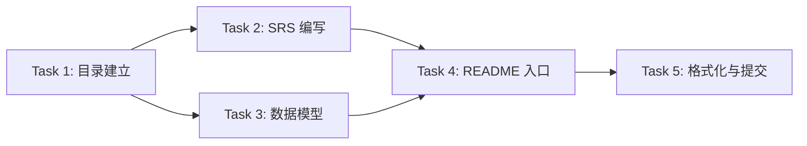

# 资产台账系统需求文档（SRS + 概念数据模型）Implementation Plan

> **For Claude:** REQUIRED SUB-SKILL: Use superpowers:executing-plans to implement this plan task-by-task.

**Goal:** 在仓库内沉淀《需求规格说明书（SRS，含可验收条款）》与《概念数据模型（含 ER/状态机图）》两份文档，并在 README 中建立入口。

**Architecture:** 以 `docs/requirements/` 为落点输出两份 Markdown 文档；关键流程与数据模型使用 Mermaid 表达并通过脚本校验；README 仅新增一个简短中文入口区块，避免影响现有模板说明。

**Tech Stack:** Markdown、Mermaid（`~/.codex/skills/mermaid/scripts/validate_mermaid.sh`）、Prettier（可选：仅格式化新增/修改文件）。

---

### Task 1: 建立文档目录与计划落点

**Files:**

- Create: `docs/requirements/asset-ledger-srs.md`
- Create: `docs/design/asset-ledger-data-model.md`
- Modify: `README.md`

**Step 1: 确认目录存在**

Run:

```bash
mkdir -p docs/plans docs/requirements
```

Expected: 目录存在且无报错。

**Step 2: 创建空文档骨架**

Run:

```bash
touch docs/requirements/asset-ledger-srs.md docs/design/asset-ledger-data-model.md
```

Expected: 两个文件创建成功。

**Step 3: 提交（可选）**

若需要提交：

```bash
git add docs/plans/2026-01-26-asset-ledger-specs.md
git commit -m "docs: add plan for asset ledger specs"
```

---

### Task 2: 编写《需求规格说明书（SRS）》

**Files:**

- Modify: `docs/requirements/asset-ledger-srs.md`

**Step 1: 写入 SRS（以可验收条款为中心）**

内容包含（至少）：

- 背景/目标/范围/不做清单
- 术语表
- 角色与权限（管理员/普通用户）
- 功能需求（按 FR 编号）+ 每条验收标准（Given/When/Then）
- 非功能需求（保留策略=永久、软删除、可观测/安全/性能的底线）
- 约束与假设（例如：阿里云 Cluster 为空）

**Step 2: 自检可读性**

人工检查：

- 每条 FR 是否可独立验收
- 是否避免“实现细节”与“需求”混写

---

### Task 3: 编写《概念数据模型》并补充 Mermaid 图

**Files:**

- Modify: `docs/design/asset-ledger-data-model.md`

**Step 1: 写入实体/关系定义**

内容包含（至少）：

- 核心实体：Source、Run、SourceRecord、Asset、Relation、DuplicateCandidate、MergeAudit、CustomFieldDefinition、CustomFieldValue、User
- 关键字段（概念级）、基数关系、唯一性约束
- 状态机（Run/Asset/DuplicateCandidate/SourceRecord 可见性）

**Step 2: 添加 Mermaid 图**

至少包含：

- ER 图（概念级）
- 状态图（Run 状态 + DuplicateCandidate 状态）

**Step 3: 校验 Mermaid**

Run:

```bash
~/.codex/skills/mermaid/scripts/validate_mermaid.sh docs/design/asset-ledger-data-model.md
```

Expected: 输出 `✅ ... Valid`。

---

### Task 4: README 增加文档入口

**Files:**

- Modify: `README.md`

**Step 1: 增加“台账系统文档”入口区块**

要求：

- 简短中文说明 + 两个链接
- 不重写现有英文模板内容（只追加一个区块）

---

### Task 5: 格式化与最终校验

**Files:**

- Modify: `docs/requirements/asset-ledger-srs.md`
- Modify: `docs/design/asset-ledger-data-model.md`
- Modify: `README.md`

**Step 1: 可选格式化（仅触达新增/修改文件）**

Run:

```bash
bunx prettier docs/requirements/asset-ledger-srs.md docs/design/asset-ledger-data-model.md docs/plans/2026-01-26-asset-ledger-specs.md README.md --write
```

Expected: 无报错，格式化完成。

**Step 2: 校验（可选）**

Run:

```bash
bun run format:check
```

Expected: 通过（只允许报告与本次无关文件）。

**Step 3: 提交（可选）**

若需要提交：

```bash
git add docs/requirements/asset-ledger-srs.md docs/design/asset-ledger-data-model.md README.md
git commit -m "docs: add asset ledger SRS and data model"
```

---

## 里程碑定义

| 里程碑 | 目标         | 交付物                       | 完成标准                      |
| ------ | ------------ | ---------------------------- | ----------------------------- |
| M1     | 文档骨架建立 | 空文档 + 目录结构            | Task 1 完成，目录存在         |
| M2     | SRS 初稿完成 | `asset-ledger-srs.md`        | Task 2 完成，FR/NFR 可验收    |
| M3     | 数据模型完成 | `asset-ledger-data-model.md` | Task 3 完成，Mermaid 校验通过 |
| M4     | 文档入口建立 | README 更新                  | Task 4 完成，链接可访问       |
| M5     | 最终交付     | 格式化 + 提交                | Task 5 完成，CI 通过          |

## 风险评估与缓解措施

### 高风险

| 风险             | 影响               | 概率 | 缓解措施                     |
| ---------------- | ------------------ | ---- | ---------------------------- |
| 需求理解偏差     | SRS 与实际业务不符 | 中   | 每个 FR 编写后与业务方确认   |
| Mermaid 语法错误 | 文档渲染失败       | 低   | 使用校验脚本，每次修改后验证 |

### 中风险

| 风险         | 影响             | 概率 | 缓解措施                  |
| ------------ | ---------------- | ---- | ------------------------- |
| 术语不一致   | 文档间理解混乱   | 中   | 建立术语表，统一引用      |
| 验收标准模糊 | 无法判断是否完成 | 中   | 使用 Given/When/Then 格式 |
| 数据模型遗漏 | 实现时发现缺失   | 低   | 与 SRS 交叉检查           |

### 低风险

| 风险         | 影响         | 概率 | 缓解措施                  |
| ------------ | ------------ | ---- | ------------------------- |
| 格式化冲突   | CI 失败      | 低   | 提交前运行 `format:check` |
| 文档链接失效 | 用户无法访问 | 低   | 使用相对路径              |

## 完成标准（Definition of Done）

### 文档级完成标准

| 文档                         | 完成标准                                                                                                   |
| ---------------------------- | ---------------------------------------------------------------------------------------------------------- |
| `asset-ledger-srs.md`        | ✅ 包含背景/目标/范围/术语表<br>✅ FR 编号连续，每条有验收标准<br>✅ NFR 有可量化指标<br>✅ 无实现细节混入 |
| `asset-ledger-data-model.md` | ✅ 核心实体定义完整<br>✅ 关系基数明确<br>✅ 状态机图可渲染<br>✅ Mermaid 校验通过                         |
| `README.md`                  | ✅ 文档入口链接有效<br>✅ 不破坏现有内容                                                                   |

### 任务级完成标准

| 任务   | 完成标准                       |
| ------ | ------------------------------ |
| Task 1 | 目录存在，空文件创建成功       |
| Task 2 | SRS 内容完整，自检通过         |
| Task 3 | 数据模型完整，Mermaid 校验通过 |
| Task 4 | README 链接可访问              |
| Task 5 | 格式化通过，CI 无报错          |

### 整体完成标准

- [ ] 所有里程碑（M1-M5）完成
- [ ] 所有高风险已缓解或接受
- [ ] 文档间术语一致
- [ ] CI 流水线通过
- [ ] 业务方确认 SRS 符合预期

## 依赖关系



## 检查清单（Checklist）

### 开始前

- [ ] 确认 `docs/` 目录结构
- [ ] 确认 Mermaid 校验脚本可用
- [ ] 确认 Prettier 配置正确

### 执行中

- [ ] Task 1: 目录创建完成
- [ ] Task 2: SRS 初稿完成
- [ ] Task 2: SRS 自检通过
- [ ] Task 3: 数据模型初稿完成
- [ ] Task 3: Mermaid 校验通过
- [ ] Task 4: README 更新完成
- [ ] Task 5: 格式化完成
- [ ] Task 5: CI 通过

### 完成后

- [ ] 所有文档链接有效
- [ ] 业务方确认
- [ ] 代码已提交
