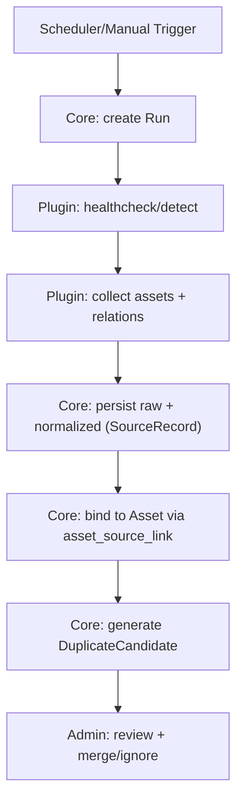
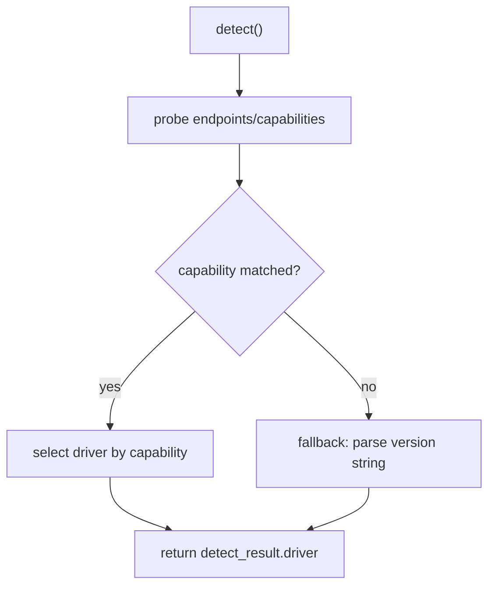

# 资产台账系统采集插件参考（开源组件优先）

版本：v1.0（冻结）  
日期：2026-01-26

> 目标：台账“本体”自研（入库、关系、疑似重复、人工合并、审计、自定义字段等），采集插件尽量基于成熟开源组件/官方 SDK/CLI，插件只做“薄适配层”，避免重复造轮子。

## 1. 设计原则

1. **插件薄、核心厚**：插件只做目标探测 + 拉取 + 规范化输出 + raw 留存，不在插件里实现台账域逻辑（疑似重复、合并等由核心处理）。
2. **契约优先**：核心与插件通过“统一输入/输出契约”解耦；插件可用任意语言实现。
3. **能力探测优先于版本号**：优先以 capabilities/API 探测选择 driver；版本号仅作为 fallback。
4. **可回放**：插件必须输出 `raw_payload`（永久保留），便于后续回放/补算/审计。
5. **安全默认**：凭证只通过安全通道传递；插件日志必须脱敏；raw 中不得包含明文凭证。

## 2. 插件接口契约（概念）

### 2.1 输入（核心 → 插件）

建议插件接收一个 JSON 配置（stdin/文件/HTTP body 均可），最小结构：

```json
{
  "source": {
    "source_id": "src_123",
    "source_type": "vcenter",
    "config": {},
    "credential": {}
  },
  "request": {
    "run_id": "run_456",
    "mode": "detect|collect|healthcheck",
    "now": "2026-01-26T12:00:00Z"
  }
}
```

> `credential` 字段建议由核心在运行时注入（不落盘），插件不得将其写入日志/输出。

### 2.2 输出（插件 → 核心）

建议统一输出为 JSON（stdout/HTTP response），包含四块：

```json
{
  "detect": {
    "target_version": "8.1",
    "capabilities": {},
    "driver": "pve-cap-v2"
  },
  "assets": [
    {
      "external_kind": "vm|host|cluster",
      "external_id": "opaque-string",
      "normalized": {},
      "raw_payload": {}
    }
  ],
  "relations": [
    {
      "type": "runs_on|member_of",
      "from": { "external_kind": "vm", "external_id": "..." },
      "to": { "external_kind": "host|cluster", "external_id": "..." },
      "raw_payload": {}
    }
  ],
  "stats": { "assets": 0, "relations": 0, "warnings": [] }
}
```

关键约束：

- `external_id` 必须在“同一 Source 内稳定”，用于持续追踪（asset_source_link 的 `(source_id, external_kind, external_id)` 唯一）。
- `raw_payload` 永久保留；可压缩；可附 `raw_hash`（由核心计算也可）。
- 阿里云不映射 Cluster：`cluster` 资产可不输出；`runs_on/member_of` 关系可为空。

## 3. 采集流程与职责边界



## 4. 目标版本适配策略（driver 选择）

推荐策略：

- 插件内部维护多个 driver（例如 `pve-driver-v1`、`pve-driver-v2`）。
- `detect()` 先探测 capabilities（例如 API endpoint/字段存在性/权限集合），再选择 driver。
- 每次 Run 必须回传 `driver` 并由核心记录到 run 表中，便于排错与回滚。



## 5. 推荐开源组件清单（按来源）

> 说明：这里列的是“采集侧能力”的成熟组件。最终选型取决于你插件语言栈与运维形态（容器化/二进制/脚本）。

### 5.1 vCenter / ESXi（VM ↔ Host ↔ Cluster）

- Go：
  - `vmware/govmomi`（建议首选，生态成熟，含 `govc` CLI）。
- Python：
  - `pyVmomi`（VMware vSphere Python binding；可配合社区样例）。

采集要点：

- VM 强标识建议优先使用 vCenter 的 MoRef/UUID（确保同一 vCenter 内稳定）。
- 关系输出：
  - VM → Host：ESXi Host
  - Host → Cluster：vCenter Cluster（若无 cluster 概念则不输出 member_of）

### 5.2 PVE / Proxmox VE（VM ↔ Host ↔ Cluster）

- Python：
  - `proxmoxer`（REST API 封装，适合作为薄适配层）。
- Go：
  - `Telmate/proxmox-api-go`（REST API 封装）。

采集要点：

- `external_id` 可使用 `(node, vmid)` 组合（可序列化为一个字符串），确保同一 PVE 集群内稳定。
- Cluster 语义：PVE cluster；若未配置 cluster，可将 node 作为 host，cluster 为空或输出一个“单节点 cluster”（由你决定，建议先不自动造 cluster）。

### 5.3 Hyper-V（VM ↔ Host ↔ Cluster）

推荐路线：**PowerShell（Hyper-V 模块）输出 JSON**，插件仅负责远程执行与解析。

- 远程执行：
  - Python：`pywinrm`（WinRM client）
  - Go：`masterzen/winrm`

采集要点：

- VM 强标识：Hyper-V VM ID（GUID）。
- Cluster：若是 Failover Cluster，可输出 Host→Cluster；否则 cluster 为空即可。

### 5.4 阿里云 ECS（VM 为主；Host/Cluster 为空）

推荐路线：优先使用官方 SDK v2 或官方 CLI，插件只做分页/限流/字段映射。

- Go：
  - `aliyun/alibabacloud-go-sdk`（v2）
- CLI：
  - `aliyun/aliyun-cli`（快速落地，可直接输出 JSON；适合作为 PoC/备选实现）

采集要点：

- `external_id`：实例 ID（instanceId）。
- 关系：不输出 runs_on/member_of（默认空）。
- Cluster：为空（不映射 region/zone/vpc）。

### 5.5 物理机/第三方平台（示例：Redfish、监控平台）

本系统不绑定具体平台；只要求插件输出 `host` 资产即可。

- Redfish（BMC）：
  - Go：`stmcginnis/gofish`
- 监控/资产平台（示例）：
  - Zabbix：Python `pyzabbix`（仅示例，不作为系统依赖）

采集要点：

- `external_id`：尽量使用平台内稳定 ID（hostId/设备序列号/管理 IP + 资产编号等）。
- 注意“同一物理机在多来源出现”的情况：交由核心生成疑似重复候选并人工合并。

## 6. Raw 永久保留与脱敏要求

1. 插件必须输出 raw（raw_payload），核心永久保留。
2. raw 中不得包含明文凭证（Token/AK/SK/密码）。若目标 API 回显敏感字段，插件需在输出前清洗。
3. 插件日志必须脱敏；建议输出“可定位问题的上下文”（请求 URL/状态码/traceId 等），但不得输出密钥。

## 7. 插件交付形态建议（非强制）

推荐按运维与隔离需求选择其一：

- **容器化插件**：核心通过容器运行插件（隔离依赖/权限），插件用 stdout 输出 JSON。
- **独立二进制/脚本**：核心以子进程方式调用（适合内网环境）。
- **HTTP 服务型插件**：插件常驻服务，核心通过 HTTP 调用（适合高频/多次调用，但你当前需求是每日一次，可后置）。
