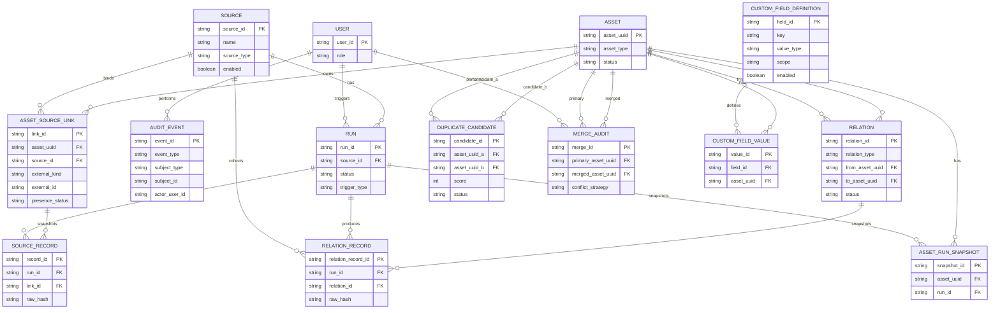
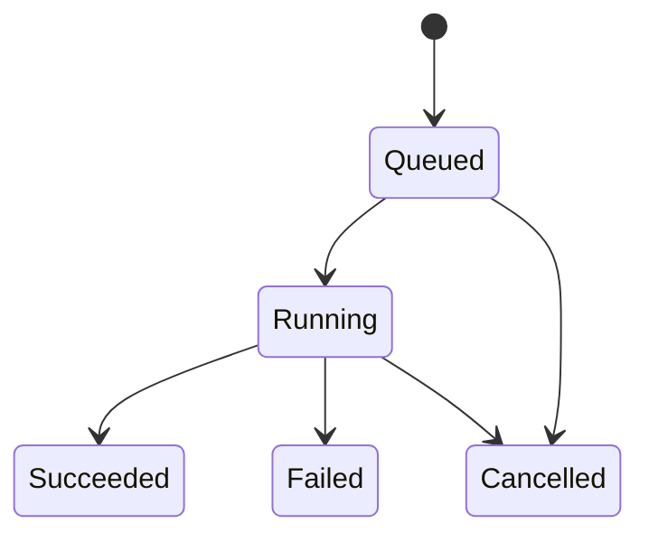
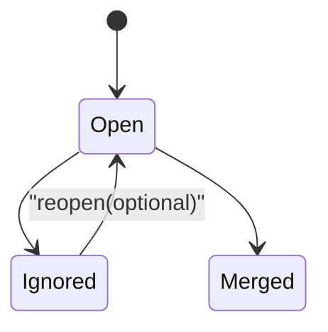

# 资产台账系统概念数据模型（Conceptual Data Model）

版本：v1.0（冻结）  
日期：2026-01-26

## 文档简介

本文档用于沉淀“资产台账系统”的**概念数据模型**与关键约束：必须有哪些实体、如何关联、哪些字段需要可追溯、哪些唯一性/索引是硬约束。它回答“数据应该怎么组织”，不绑定具体数据库实现细节（字段类型/分库分表等可在实现阶段细化）。

- 适用读者：研发、测试、架构评审、DBA/运维。
- 使用方式：当 SRS（需求）与实现发生冲突时，用本文对齐“实体边界/约束/状态机”；发生歧义时，优先以 SRS 的业务语义为准。
- 关联文档：
  - SRS：`docs/requirements/asset-ledger-srs.md`
  - 采集插件参考：`docs/requirements/asset-ledger-collector-reference.md`

> 本文为“概念模型 + 关键约束”沉淀，目标是让后续实现/评审对齐：哪些实体必须存在、如何关联、状态如何流转、哪些字段需要可追溯。本文不绑定具体数据库实现，但会标注关键唯一性与索引建议。

## 1. 建模原则

- **系统主键**：所有统一资产使用系统生成 `asset_uuid` 作为主键，不依赖外部平台 ID。
- **来源可追溯**：所有采集数据必须能追溯到 `source` 与 `run`，且 raw 永久保留。
- **软删除语义**：来源消失不删除数据，通过“可见性/下线状态”表达。
- **关系最小闭环**：仅支持 `VM --runs_on--> Host --member_of--> Cluster` 两类关系，允许缺边。
- **去重不自动合并**：跨来源重复仅生成 `duplicate_candidate`，由管理员手工合并。
- **规则固定**：疑似重复规则/阈值不做配置（后续迭代再开放）。

## 2. 实体清单（概念级）

> 下文字段以“建议字段”表达概念含义；实现可调整命名，但应保留语义与约束。

### 2.1 user（用户）

- `user_id`：主键
- `role`：`admin` / `user`
- `created_at`

### 2.2 source（来源）

- `source_id`：主键
- `name`：来源名称（唯一建议：同租户内唯一）
- `source_type`：`aliyun` / `vcenter` / `pve` / `hyperv` / `third_party` …
- `enabled`：启用/停用
- `schedule`：每天一次的触发配置（例如固定时刻或 cron 表达式）
- `schedule_timezone`：时区（IANA TZ，例如 `Asia/Shanghai`）
- `config`：非敏感连接配置（JSON）
- `credential_ref`：凭证引用（密文存储在独立实体/密钥系统）
- `created_at` / `updated_at`

### 2.3 run（采集批次）

- `run_id`：主键
- `source_id`：外键
- `trigger_type`：`schedule` / `manual`
- `mode`：`collect` / `detect` / `healthcheck`
- `triggered_by_user_id`：手动触发时记录操作者
- `status`：见 5.1 状态机
- `started_at` / `finished_at`
- `detect_result`：目标版本/能力探测摘要（JSON，脱敏）
- `collector_plugin`：插件标识（`plugin_id`、`plugin_version`）
- `collector_driver`：driver 标识（用于目标版本适配）
- `stats`：采集统计（新增/更新/缺失/关系数量等，JSON）
- `error_summary`：失败摘要（脱敏）
- `errors`：结构化错误数组（JSON，字段参考插件 `errors[]`）
- `warnings`：非致命告警数组（JSON，字段参考插件 `stats.warnings[]`）

### 2.4 asset（统一资产）

- `asset_uuid`：主键（系统生成）
- `asset_type`：`vm` / `host` / `cluster`
- `display_name`：展示名称（可来自来源或人工编辑）
- `status`：`in_service` / `offline` / `merged`（offline 可由可见性汇总计算，也可落库缓存）
- `merged_into_asset_uuid`：当 status=merged 时指向主资产
- `created_at` / `updated_at`

> 说明：统一字段（例如 CPU/内存/IP 等）可实现为“规范化列”或“canonical_json”，但必须可追溯来源（见 source_record 与审计）。

### 2.5 asset_source_link（统一资产与来源对象的绑定，用于持续追踪 + 软删除）

> 该实体用于解决两个问题：
>
> 1. **同一来源内**如何把“同一对象”在不同 Run 中持续归属到同一个 Asset（不等于跨来源自动合并）。
> 2. **软删除**：来源中消失的对象如何表达 last_seen 与可见性。

- `link_id`：主键
- `asset_uuid`：外键 → asset
- `source_id`：外键 → source
- `external_kind`：`vm` / `host` / `cluster`（与来源对象类型一致）
- `external_id`：来源侧强标识（如 vCenter MoRef、PVE VMID、阿里云 instanceId 等）
- `first_seen_at`：首次发现时间（Run 时间）
- `last_seen_at`：最后一次“被发现”的时间
- `presence_status`：`present` / `missing`
- `last_seen_run_id`：外键 → run（最后一次 present 的 run）
- `created_at` / `updated_at`

**关键约束（建议）**

- 唯一：`(source_id, external_kind, external_id)` 唯一  
  解释：同一来源同一对象只能对应一个绑定记录，确保“持续追踪”确定性。

### 2.6 source_record（来源记录：每次采集的原始快照，永久保留）

- `record_id`：主键
- `run_id`：外键 → run
- `source_id`：外键 → source（冗余可选，便于查询）
- `link_id`：外键 → asset_source_link（建议优先关联 link，而不是直接关联 asset）
- `asset_uuid`：外键 → asset（冗余可选，便于查询）
- `collected_at`：采集到该条记录的时间
- `normalized`：标准化字段（JSON）
- `raw_payload`：原始数据（JSON/二进制，永久保留，可压缩）
- `raw_hash`：原始数据摘要（用于快速比对/去重/审计）

**normalized 最小字段集合（满足 dup-rules-v1）**

> 口径：键不存在时视为缺失，缺失不计分；实现可按来源能力填充。

- `identity.machine_uuid`（vm）
- `network.mac_addresses[]`（vm）
- `network.ip_addresses[]`（vm）
- `identity.hostname`（vm）
- `identity.serial_number`（host）
- `network.management_ip`（host）
- 辅助键（用于解释与人工研判，不强制计分）：`os.fingerprint`、`resource.profile`、`identity.cloud_native_id`

### 2.7 relation_record（关系来源记录：每次采集的关系 raw 快照，永久保留）

- `relation_record_id`：主键
- `run_id`：外键 → run
- `source_id`：外键 → source
- `relation_id`：外键 → relation（可空，核心 upsert 后回填）
- `relation_type`：`runs_on` / `member_of`
- `from_asset_uuid`：外键 → asset
- `to_asset_uuid`：外键 → asset
- `collected_at`：采集到该条记录的时间
- `raw_payload`：原始数据（JSON/二进制，永久保留）
- `raw_hash`：原始数据摘要

**关键约束（建议）**

- 索引：`(run_id)`、`(source_id)`、`(relation_type, from_asset_uuid, to_asset_uuid)`

### 2.8 relation（资产关系：VM↔Host↔Cluster）

- `relation_id`：主键
- `relation_type`：`runs_on` / `member_of`
- `from_asset_uuid`：外键 → asset
- `to_asset_uuid`：外键 → asset
- `source_id`：外键 → source（该关系由哪个来源采集/推断）
- `first_seen_at` / `last_seen_at`
- `status`：`active` / `inactive`（inactive 表示关系在后续 Run 中不再出现，但历史保留）

**关键约束（建议）**

- 唯一：`(relation_type, from_asset_uuid, to_asset_uuid, source_id)` 唯一  
  解释：同一来源对同一对资产的同类型关系应归并为一条关系边，并用 first/last_seen 表示持续时间。

### 2.9 duplicate_candidate（疑似重复候选）

- `candidate_id`：主键
- `asset_uuid_a`：外键 → asset
- `asset_uuid_b`：外键 → asset
- `score`：0-100
- `reasons`：命中原因（JSON，可解释）
- `status`：`open` / `ignored` / `merged`
- `created_at` / `updated_at`
- `last_observed_at`：最近一次命中时间（可选，用于降噪）
- `ignored_by_user_id` / `ignored_at` / `ignore_reason`（当 status=ignored）

**关键约束（建议）**

- 唯一：`(asset_uuid_a, asset_uuid_b)` 在规范化顺序（a<b）后唯一，避免重复候选。

### 2.10 merge_audit（合并审计：永久保留）

- `merge_id`：主键
- `primary_asset_uuid`：主资产（保留的 asset_uuid）
- `merged_asset_uuid`：被合并资产
- `performed_by_user_id`
- `performed_at`
- `conflict_strategy`：`primary_wins` / `latest_wins` / `manual_pick`（若实现了手工逐字段选择）
- `summary`：合并影响摘要（JSON）
- `snapshot_ref`：合并前快照引用（可选，为未来“撤销合并”预留）

### 2.11 audit_event（通用审计事件：永久保留）

> 目标：满足 SRS 的“重要操作审计永久保留”与“字段变更可追溯”。审计记录应**只增不改**（append-only），严禁物理删除。

- `event_id`：主键
- `occurred_at`：事件发生时间
- `event_type`：事件类型（建议使用 `domain.action` 命名，如 `source.updated`、`run.triggered`、`duplicate_candidate.ignored`、`asset.merged`、`custom_field.value_updated`）
- `actor_user_id`：操作者（系统自动事件可为空）
- `subject_type`：被影响对象类型（如 `source/run/asset/duplicate_candidate/custom_field_definition/custom_field_value`）
- `subject_id`：被影响对象标识（字符串；例如 `asset_uuid`、`source_id`）
- `before`：变更前快照（JSON，可为空）
- `after`：变更后快照（JSON，可为空）
- `diff`：差异摘要（JSON，可选；用于减少 UI 计算成本）
- `context`：上下文（JSON，可选：request_id、ip、ua、trace_id 等；需脱敏）

**关键约束 / 索引建议**

- 索引：`(subject_type, subject_id, occurred_at desc)`（实体审计时间线）
- 索引：`(actor_user_id, occurred_at desc)`（按人追溯）
- 索引：`(event_type, occurred_at desc)`（按事件类型审计）

**决策点 D-05：审计落库形态**

- 已决策：方案 A（仅 audit_event）

- 方案 A（已选/最小表）：仅使用 `audit_event` 统一承载所有审计（包括字段值变更）
  - 优点：模型简单、扩展性强；缺点：字段值历史查询需要在 JSON 上做筛选/索引设计。
- 方案 B（分表）：保留 `audit_event`，但字段值/高频事件另建专用 history 表（如 `custom_field_value_history`）
  - 优点：关键历史查询更容易；缺点：表增多、维护成本更高。

**决策点 D-06：subject 是否做强外键（polymorphic vs typed FK）**

- 已决策：方案 B（typed FK）

- 方案 A（polymorphic）：仅 `subject_type + subject_id`（无强外键）
  - 优点：灵活；缺点：缺少参照完整性，误写更难发现。
- 方案 B（typed FK）：为常见对象增加可选外键列（`asset_uuid/source_id/run_id/candidate_id/...`），同时保留 `subject_type/id`
  - 优点：强约束与查询性能更好；缺点：nullable 列增多，DDL 更重。

补充说明（用于下次决策）：

- 何时倾向方案 A：事件量大、对象类型会扩展、审计主要用于“时间线展示/导出”，并且你能接受由应用层保证 subject 正确性。
- 何时倾向方案 B：审计需要经常 join 回业务表做筛选（例如“列出某 source 的全部变更”）、希望 DB 帮你兜底参照完整性、以及能接受 schema 更重。
- 折中实践（常见）：表结构按方案 A 设计；但对“常用 subject”（如 asset/source/run）额外增加冗余列与索引（不强 FK 或弱 FK），以优化查询与减少 JSON 过滤成本。

### 2.12 custom_field_definition / custom_field_value（自定义字段）

`custom_field_definition`：

- `field_id`：主键
- `key`：字段 key（机器可读，唯一）
- `name`：字段名（展示）
- `value_type`：`string/int/float/bool/date/datetime/enum/json`
- `scope`：`vm/host/cluster/global`
- `required`：是否必填
- `enum_options`：枚举值（JSON，可选）
- `enabled`：启用/停用
- `created_at` / `updated_at`

`custom_field_value`：

- `value_id`：主键
- `field_id`：外键 → custom_field_definition
- `asset_uuid`：外键 → asset
- `value`：值（JSON 或 typed columns）
- `updated_by_user_id`
- `updated_at`

**关键约束（建议）**

- 唯一：`(field_id, asset_uuid)` 唯一（一资产一字段一个值；历史追溯由审计或历史表完成）。

### 2.13 asset_run_snapshot（按 Run 的资产快照/摘要，物化）

> 目标：支撑 SRS 要求的“按 Run 的变化历史/快照/变更摘要”，并固化口径以提升读性能与一致性。

- `snapshot_id`：主键
- `asset_uuid`：外键 → asset
- `run_id`：外键 → run（表示该快照归属于哪个 Run）
- `asset_type`：冗余可选（便于过滤）
- `canonical`：统一视图快照（JSON；由 core 聚合生成）
- `diff_summary`：相对上一快照的变更摘要（JSON，可选）
- `computed_at`：计算时间

**快照口径（含关系）**

- `canonical` 必须包含关系摘要（runs_on/member_of 的目标引用与展示字段）
- `diff_summary` 必须包含关系变化（新增/移除/变化原因）

**关键约束（建议）**

- 唯一：`(asset_uuid, run_id)` 唯一（同一资产同一 Run 只生成一条快照）
- 索引：`(asset_uuid, run_id)`、`(run_id)`、`(asset_uuid, computed_at desc)`

## 3. 核心关系（文本说明）

- source 1—N run
- run 1—N source_record
- run 1—N relation_record
- asset 1—N asset_source_link
- asset_source_link 1—N source_record
- relation 1—N relation_record
- run 1—N asset_run_snapshot
- asset 1—N asset_run_snapshot
- asset N—N asset（通过 relation）
- asset N—N asset（通过 duplicate_candidate 进行“候选关联”，不等于合并）
- merge_audit 记录 asset 合并历史（merged_asset_uuid → primary_asset_uuid）
- user 1—N audit_event（actor），audit_event 通过 subject 引用任意实体（typed FK + subject_type/id）

## 4. Mermaid：概念 ER 图

## 5. Mermaid：状态机

### 5.1 Run 状态

### 5.2 DuplicateCandidate 状态

> 说明：是否支持从 Ignored 重新打开可作为后续迭代；若不支持，可移除该迁移。

## 6. 审计与历史口径（面向实现）

### 6.1 审计事件（audit_event）口径

- 审计应覆盖（最小集合）：source 创建/编辑/启停、Run 触发（手动/定时）、duplicate_candidate 忽略/合并、asset 合并、字段定义新增/停用、字段值更新。
- 审计记录应只增不改：任何更正以“新事件”追加，避免篡改历史。
- 审计数据需脱敏：不得记录明文凭证；context 中的 token/密码必须清洗。

### 6.2 “按 Run 的资产历史”口径

基础真相：`source_record` 是“每次 Run 的来源快照”，永久保留；它与 `asset_source_link` 绑定解决“同一来源内持续追踪”。

资产详情的“历史”建议按两条时间线组合展示：

1. **采集历史（Run-driven）**：按时间列出该资产关联的所有 `source_record`（可按 `run.started_at` 排序并分组）
2. **人工操作历史（Audit-driven）**：按时间列出影响该资产的 `audit_event`（字段值更新、合并、忽略等）

合并后的历史：当 asset B 合并进 asset A 时，B 的历史不应丢失；展示层可将 B 的 `source_record` 与 `audit_event` 归并到 A 的时间线中，同时保留“来源于被合并资产 B”的标识。

**决策点 D-07：历史“快照/变更摘要”如何生成**

- 已决策：方案 B（物化快照 asset_run_snapshot）

- 方案 A（最小实现）：不新增表；基于 `source_record.normalized` 在查询时生成“快照展示”与“变更摘要”
  - 优点：不引入额外存储；缺点：API/页面需要做 diff，复杂查询可能较慢。
- 方案 B（已选/物化快照）：新增 `asset_run_snapshot`（或等价）持久化“每次 Run 的展示快照/摘要”
  - 优点：读性能好、口径稳定；缺点：存储显著增加，需要定义聚合规则（跨来源如何合并字段）。

### 6.3 成功/失败 Run 对“缺失/关系/状态”的影响（强约束）

- 仅 **Succeeded** 的 Run 才能推进：
  - `asset_source_link.presence_status`（present/missing）与 `last_seen_at`
  - `relation.last_seen_at` 与 `relation.status`（active/inactive）
  - 由可见性汇总得到的 `asset.status`（in_service/offline）
- **Failed/Cancelled** 的 Run 可持久化错误与部分采集结果（用于排障），但不得作为“缺失/下线/关系失活”的依据。

## 待决策（Decision Log）

- D-05：A（仅 audit_event）
- D-06：B（typed FK，保留 subject_type + subject_id）
- D-07：B（物化 `asset_run_snapshot`）
