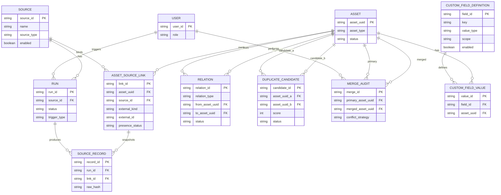

# 资产台账系统概念数据模型（Conceptual Data Model）

版本：v1.0（冻结）  
日期：2026-01-26

> 本文为“概念模型 + 关键约束”沉淀，目标是让后续实现/评审对齐：哪些实体必须存在、如何关联、状态如何流转、哪些字段需要可追溯。本文不绑定具体数据库实现，但会标注关键唯一性与索引建议。

## 1. 建模原则

- **系统主键**：所有统一资产使用系统生成 `asset_uuid` 作为主键，不依赖外部平台 ID。
- **来源可追溯**：所有采集数据必须能追溯到 `source` 与 `run`，且 raw 永久保留。
- **软删除语义**：来源消失不删除数据，通过“可见性/下线状态”表达。
- **关系最小闭环**：仅支持 `VM --runs_on--> Host --member_of--> Cluster` 两类关系，允许缺边。
- **去重不自动合并**：跨来源重复仅生成 `duplicate_candidate`，由管理员手工合并。
- **规则固定**：疑似重复规则/阈值不做配置（后续迭代再开放）。

## 2. 实体清单（概念级）

> 下文字段以“建议字段”表达概念含义；实现可调整命名，但应保留语义与约束。

### 2.1 user（用户）

- `user_id`：主键
- `role`：`admin` / `user`
- `created_at`

### 2.2 source（来源）

- `source_id`：主键
- `name`：来源名称（唯一建议：同租户内唯一）
- `source_type`：`aliyun` / `vcenter` / `pve` / `hyperv` / `third_party` …
- `enabled`：启用/停用
- `schedule`：每天一次的触发配置（例如固定时刻或 cron 表达式）
- `config`：非敏感连接配置（JSON）
- `credential_ref`：凭证引用（密文存储在独立实体/密钥系统）
- `created_at` / `updated_at`

### 2.3 run（采集批次）

- `run_id`：主键
- `source_id`：外键
- `trigger_type`：`schedule` / `manual`
- `triggered_by_user_id`：手动触发时记录操作者
- `status`：见 5.1 状态机
- `started_at` / `finished_at`
- `detect_result`：目标版本/能力探测摘要（JSON，脱敏）
- `collector_plugin`：插件标识（`plugin_id`、`plugin_version`）
- `collector_driver`：driver 标识（用于目标版本适配）
- `stats`：采集统计（新增/更新/缺失/关系数量等，JSON）
- `error_summary`：失败摘要（脱敏）

### 2.4 asset（统一资产）

- `asset_uuid`：主键（系统生成）
- `asset_type`：`vm` / `host` / `cluster`
- `display_name`：展示名称（可来自来源或人工编辑）
- `status`：`in_service` / `offline` / `merged`（offline 可由可见性汇总计算，也可落库缓存）
- `merged_into_asset_uuid`：当 status=merged 时指向主资产
- `created_at` / `updated_at`

> 说明：统一字段（例如 CPU/内存/IP 等）可实现为“规范化列”或“canonical_json”，但必须可追溯来源（见 source_record 与审计）。

### 2.5 asset_source_link（统一资产与来源对象的绑定，用于持续追踪 + 软删除）

> 该实体用于解决两个问题：
>
> 1. **同一来源内**如何把“同一对象”在不同 Run 中持续归属到同一个 Asset（不等于跨来源自动合并）。
> 2. **软删除**：来源中消失的对象如何表达 last_seen 与可见性。

- `link_id`：主键
- `asset_uuid`：外键 → asset
- `source_id`：外键 → source
- `external_kind`：`vm` / `host` / `cluster`（与来源对象类型一致）
- `external_id`：来源侧强标识（如 vCenter MoRef、PVE VMID、阿里云 instanceId 等）
- `first_seen_at`：首次发现时间（Run 时间）
- `last_seen_at`：最后一次“被发现”的时间
- `presence_status`：`present` / `missing`
- `last_seen_run_id`：外键 → run（最后一次 present 的 run）
- `created_at` / `updated_at`

**关键约束（建议）**

- 唯一：`(source_id, external_kind, external_id)` 唯一  
  解释：同一来源同一对象只能对应一个绑定记录，确保“持续追踪”确定性。

### 2.6 source_record（来源记录：每次采集的原始快照，永久保留）

- `record_id`：主键
- `run_id`：外键 → run
- `source_id`：外键 → source（冗余可选，便于查询）
- `link_id`：外键 → asset_source_link（建议优先关联 link，而不是直接关联 asset）
- `asset_uuid`：外键 → asset（冗余可选，便于查询）
- `collected_at`：采集到该条记录的时间
- `normalized`：标准化字段（JSON）
- `raw_payload`：原始数据（JSON/二进制，永久保留，可压缩）
- `raw_hash`：原始数据摘要（用于快速比对/去重/审计）

### 2.7 relation（资产关系：VM↔Host↔Cluster）

- `relation_id`：主键
- `relation_type`：`runs_on` / `member_of`
- `from_asset_uuid`：外键 → asset
- `to_asset_uuid`：外键 → asset
- `source_id`：外键 → source（该关系由哪个来源采集/推断）
- `first_seen_at` / `last_seen_at`
- `status`：`active` / `inactive`（inactive 表示关系在后续 Run 中不再出现，但历史保留）

**关键约束（建议）**

- 唯一：`(relation_type, from_asset_uuid, to_asset_uuid, source_id)` 唯一  
  解释：同一来源对同一对资产的同类型关系应归并为一条关系边，并用 first/last_seen 表示持续时间。

### 2.8 duplicate_candidate（疑似重复候选）

- `candidate_id`：主键
- `asset_uuid_a`：外键 → asset
- `asset_uuid_b`：外键 → asset
- `score`：0-100
- `reasons`：命中原因（JSON，可解释）
- `status`：`open` / `ignored` / `merged`
- `created_at` / `updated_at`
- `last_observed_at`：最近一次命中时间（可选，用于降噪）
- `ignored_by_user_id` / `ignored_at` / `ignore_reason`（当 status=ignored）

**关键约束（建议）**

- 唯一：`(asset_uuid_a, asset_uuid_b)` 在规范化顺序（a<b）后唯一，避免重复候选。

### 2.9 merge_audit（合并审计：永久保留）

- `merge_id`：主键
- `primary_asset_uuid`：主资产（保留的 asset_uuid）
- `merged_asset_uuid`：被合并资产
- `performed_by_user_id`
- `performed_at`
- `conflict_strategy`：`primary_wins` / `latest_wins` / `manual_pick`（若实现了手工逐字段选择）
- `summary`：合并影响摘要（JSON）
- `snapshot_ref`：合并前快照引用（可选，为未来“撤销合并”预留）

### 2.10 custom_field_definition / custom_field_value（自定义字段）

`custom_field_definition`：

- `field_id`：主键
- `key`：字段 key（机器可读，唯一）
- `name`：字段名（展示）
- `value_type`：`string/int/float/bool/date/datetime/enum/json`
- `scope`：`vm/host/cluster/global`
- `required`：是否必填
- `enum_options`：枚举值（JSON，可选）
- `enabled`：启用/停用
- `created_at` / `updated_at`

`custom_field_value`：

- `value_id`：主键
- `field_id`：外键 → custom_field_definition
- `asset_uuid`：外键 → asset
- `value`：值（JSON 或 typed columns）
- `updated_by_user_id`
- `updated_at`

**关键约束（建议）**

- 唯一：`(field_id, asset_uuid)` 唯一（一资产一字段一个值；历史追溯由审计或历史表完成）。

## 3. 核心关系（文本说明）

- source 1—N run
- run 1—N source_record
- asset 1—N asset_source_link
- asset_source_link 1—N source_record
- asset N—N asset（通过 relation）
- asset N—N asset（通过 duplicate_candidate 进行“候选关联”，不等于合并）
- merge_audit 记录 asset 合并历史（merged_asset_uuid → primary_asset_uuid）

## 4. Mermaid：概念 ER 图

## 5. Mermaid：状态机

### 5.1 Run 状态

### 5.2 DuplicateCandidate 状态

> 说明：是否支持从 Ignored 重新打开可作为后续迭代；若不支持，可移除该迁移。
